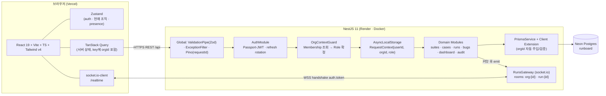
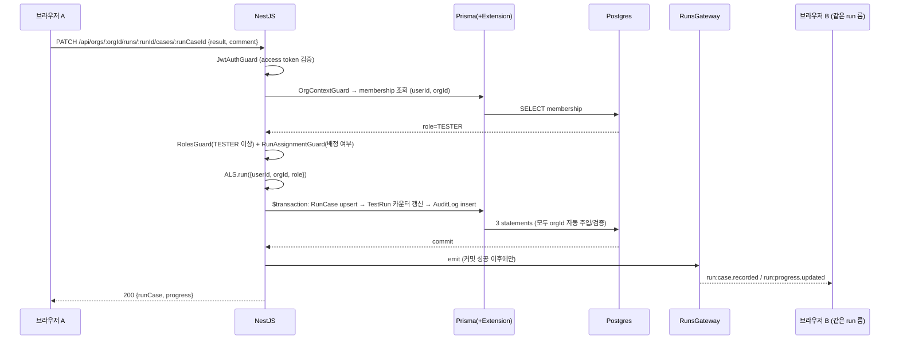
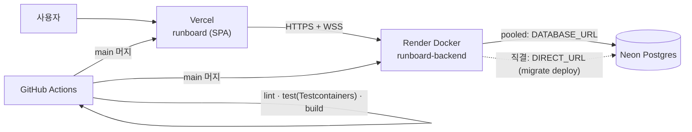

# ARCHITECTURE — Runboard

용어는 [UBIQUITOUS_LANGUAGE.md](./UBIQUITOUS_LANGUAGE.md) 기준. 기능 범위는 [SPEC.md](./SPEC.md) 기준.

## 1. 시스템 구성



### 요청 1건의 수명 (결과 기록 예시)



---

## 2. 폴더 구조

```
runboard/
├─ backend/
│  ├─ prisma/
│  │  ├─ schema.prisma
│  │  └─ migrations/
│  ├─ scripts/seed-demo.ts            # 데모 조직·계정·샘플 데이터 (idempotent)
│  ├─ src/
│  │  ├─ main.ts                      # bootstrap, swagger, CORS, WS adapter
│  │  ├─ app.module.ts
│  │  ├─ common/
│  │  │  ├─ context/request-context.ts        # AsyncLocalStorage 스토어
│  │  │  ├─ context/request-context.middleware.ts
│  │  │  ├─ decorators/ (current-user, current-org, require-role, public)
│  │  │  ├─ guards/ (jwt-auth, org-context, roles, run-assignment)
│  │  │  ├─ filters/all-exceptions.filter.ts  # 404-대신-403 정책 포함
│  │  │  ├─ pipes/zod-validation.pipe.ts
│  │  │  └─ dto/pagination.ts
│  │  ├─ prisma/
│  │  │  ├─ prisma.service.ts                 # $extends(tenantGuard) 적용 클라이언트
│  │  │  └─ tenant.extension.ts               # 조직 스코프 자동 주입/검증
│  │  ├─ auth/                                 # 회원가입·로그인·refresh 회전·재사용 탐지
│  │  ├─ organizations/                        # 조직·멤버십·초대·역할 변경
│  │  ├─ suites/  cases/  runs/  bugs/
│  │  ├─ runs/runs.gateway.ts                  # socket.io 게이트웨이
│  │  ├─ runs/run-events.service.ts            # 이벤트 페이로드 조립·emit
│  │  ├─ audit/                                # AuditService(트랜잭션 내부 기록) + 조회 API
│  │  ├─ dashboard/
│  │  └─ health/health.controller.ts
│  ├─ test/                                    # supertest + Testcontainers 통합테스트
│  ├─ Dockerfile
│  └─ .env.example
├─ frontend/
│  ├─ src/
│  │  ├─ app/ (router, providers, layout)
│  │  ├─ features/ auth · organizations · suites · runs · bugs · dashboard · audit
│  │  ├─ shared/ api(axios+refresh queue) · socket · ui · hooks · lib(zod schemas)
│  │  └─ stores/ (auth.store.ts, org.store.ts, presence.store.ts)
│  └─ vercel.json
├─ .github/workflows/ci.yml
├─ render.yaml
└─ README.md
```

**Zod 스키마 공유**: `packages/` 워크스페이스까지 만들면 툴링 비용이 커진다(ponytail). 대신 `frontend/src/shared/lib/schemas/`에 요청 DTO Zod 스키마를 두고, 백엔드는 같은 스키마 정의를 `src/**/dto/*.schema.ts`로 유지하며 **필드명·제약을 API.md 한 곳에서 관리**한다. 불일치는 통합테스트(400 케이스)로 잡는다.

---

## 3. 조직 스코프 강제 방식 (이 프로젝트의 핵심 결정)

### 결정: **AsyncLocalStorage + Prisma Client Extension(`$extends`)을 주 방어선으로 쓰고, 가드와 DB 제약으로 앞뒤를 감싼다.**

Prisma 미들웨어(`$use`)는 Prisma 7에서 제거됐고 4.16+ 이후 공식 대체재가 Client Extension이므로 **`$extends`의 `query` 컴포넌트**를 쓴다.

#### 계층 1 — 라우팅 + OrgContextGuard (인가)

- 모든 테넌트 리소스 경로는 `/api/orgs/:orgId/...`. 조직이 URL에 드러나 Swagger·로그·테스트에서 경계가 눈에 보인다.
- `OrgContextGuard`가 `(userId, orgId)`로 **Membership**을 조회한다. 없으면 `NotFoundException` (403이 아니다 — 남의 조직 id의 존재 여부를 알려주지 않는다).
- 조회된 **Role**을 `RolesGuard`/`RunAssignmentGuard`가 소비하고, 컨텍스트를 ALS에 넣는다.

#### 계층 2 — Prisma Client Extension (사고 방지)

```ts
// tenant.extension.ts (설계 스케치 — 구현은 implementer)
Prisma.defineExtension((client) =>
  client.$extends({
    query: {
      $allModels: {
        async $allOperations({ model, operation, args, query }) {
          if (!TENANT_MODELS.has(model)) return query(args); // User·RefreshToken 등 전역 모델 제외
          const ctx = RequestContext.get(); // AsyncLocalStorage
          if (!ctx?.orgId)
            throw new MissingTenantContextError(model, operation);
          // 읽기: where에 organizationId 강제 주입(호출자가 다른 값 넣었으면 예외)
          // 쓰기: data에 organizationId 강제 주입 + where 주입
          return query(applyTenantScope(args, ctx.orgId, operation));
        },
      },
    },
  }),
);
```

- **누락 시 통과가 아니라 실패**: 테넌트 모델인데 컨텍스트가 없으면 예외를 던진다. "깜빡하면 전체 조회"가 되는 방향의 실패는 만들지 않는다.
- 호출자가 명시한 `organizationId`가 컨텍스트와 다르면 예외(테스트로 검증).
- 배치/시드처럼 조직 컨텍스트가 없는 정당한 경로는 `prisma.$system` 별칭(확장 미적용 원본 클라이언트)으로만 접근하고, 그 사용처는 `scripts/`와 `auth`(User·RefreshToken)로 한정한다.

#### 계층 3 — DB 제약 (최후의 그물)

- 모든 테넌트 테이블에 `organizationId` 보유 + 부모에 `@@unique([id, organizationId])`, 자식은 **복합 FK**로 부모를 참조 → 다른 조직의 부모를 가리키는 행은 DB가 거부한다(DATA-MODEL.md 참조).

#### 기각한 대안

| 대안                                             | 기각 이유                                                                                                                                                                                                       |
| ------------------------------------------------ | --------------------------------------------------------------------------------------------------------------------------------------------------------------------------------------------------------------- |
| 서비스마다 `where: { organizationId }` 수동 작성 | 안전이 "사람의 기억"에 의존. 새 쿼리 하나 빠뜨리면 전 조직 유출. 리뷰로 막는 건 확장성이 없다.                                                                                                                  |
| Postgres RLS (`SET LOCAL app.current_org`)       | 가장 강력하지만 Neon 풀러 뒤에서 세션 변수를 안전히 쓰려면 모든 쿼리를 트랜잭션으로 감싸야 하고, Prisma·마이그레이션·시드에 정책 관리 부담이 붙는다. 2~3일 범위 대비 비용 과다 → **향후 과제로 README에 기록**. |
| 조직별 스키마/DB 분리                            | 프리티어 Neon 1 DB, 마이그레이션 N배. 소규모 SaaS에 과설계.                                                                                                                                                     |

### 왜 **Access Token에 orgId를 넣지 않는가**

- 토큰에 `orgId`/`role`을 박으면 **권한 강등·추방이 토큰 만료(15분)까지 반영되지 않는다.** 외주 인력이 섞이는 도메인에서 이건 실제 보안 결함이다.
- 토큰은 "너는 누구인가"(sub, email)만 담고, "이 조직에서 무엇을 할 수 있는가"는 **요청 시점 Membership 조회**로 정한다.
- 비용은 요청당 인덱스 1회 조회(`@@unique([userId, organizationId])`, PK 룩업 수준) → 무시 가능. 필요해지면 짧은 TTL 캐시로 최적화 가능하다는 여지만 남긴다.
- 조직 선택은 **경로 파라미터**(`:orgId`)로 표현하므로 서버는 무상태다. 프론트는 마지막 선택 조직만 localStorage에 저장(UX용, 권한 근거 아님).

---

## 4. 인증 (Passport-JWT + 리프레시 회전)

| 항목          | 값                                                                                                   |
| ------------- | ---------------------------------------------------------------------------------------------------- |
| Access Token  | JWT HS256, 15분, payload `{ sub, email, jti }`. `Authorization: Bearer`                              |
| Refresh Token | 랜덤 256bit, 7일. **DB에는 SHA-256 해시만** 저장. 응답 본문으로 전달(프론트는 메모리+localStorage)   |
| 회전          | `/auth/refresh` 호출 시 기존 토큰 폐기 + 새 토큰 발급(같은 `familyId`)                               |
| 재사용 탐지   | 이미 폐기된 refresh가 다시 오면 **그 familyId 전체 폐기** + `AUTH_REFRESH_REUSE_DETECTED` 감사로그   |
| 비밀번호      | bcrypt(cost 10 — Render 무료 CPU 기준. 12는 콜드스타트 응답을 눈에 띄게 느리게 만든다)               |
| 로그인 스키마 | 이메일 형식 검증. **단, `email === 'admin'` 리터럴 하나만 우회**(회원가입·프로필 수정엔 미적용)      |
| 실패 처리     | 사용자 존재 여부를 노출하지 않는 단일 메시지 + `AUTH_LOGIN_FAILED` 감사로그(조직 미상이면 전역 로그) |

> 쿠키 대신 Authorization 헤더를 쓰는 이유: 프론트(Vercel)와 백엔드(Render)가 **다른 도메인**이라 SameSite=None 쿠키 + CSRF 방어 세트가 추가로 필요해진다. 헤더 방식이 이 배포 토폴로지에서 가장 적은 코드로 안전하다. XSS 노출 리스크는 access 15분 + refresh 회전/재사용 탐지로 완화한다(README에 트레이드오프 명시).

---

## 5. WebSocket 설계

### 전송·인증

- socket.io, 네임스페이스 `/realtime`, transports `['websocket']`(Render 프록시에서 polling 업그레이드 이슈 회피).
- **핸드셰이크에서만 인증**: 클라이언트가 `io(url, { auth: { token: accessToken } })`로 access token 전달 → 게이트웨이 미들웨어가 검증 후 `socket.data.userId` 설정. 실패 시 연결 거부.
- access token 만료(15분)로 소켓이 죽지 않도록: 클라이언트가 refresh 성공 시 `socket.auth.token` 갱신 후 재연결. 재연결 시 룸 재조인 + REST로 전체 상태 재조회(이벤트 유실 복구).

### 룸과 조인 인가

| 룸            | 조인 조건                                           | 용도                                              |
| ------------- | --------------------------------------------------- | ------------------------------------------------- |
| `org:{orgId}` | 해당 조직의 **Membership** 보유                     | 조직 단위 알림(버그 생성, 실행 시작/종료)         |
| `run:{runId}` | 그 **TestRun**이 조인한 조직 소속 + Membership 보유 | 실행 화면 실시간 동기화, **Participant** 프레즌스 |

- `run:join` 수신 시 **REST와 동일한 인가 로직을 재사용**한다(게이트웨이가 `RunsService.assertReadable(orgId, runId, userId)` 호출). 소켓이라고 검사를 건너뛰지 않는다 — 룸 이름만 알면 남의 실행을 훔쳐보는 사고가 여기서 난다.
- 프레즌스는 인메모리(소켓 룸 멤버십)로만 관리하고 DB에 쓰지 않는다. 인스턴스 1대 전제이며, 확장 시 `@socket.io/redis-adapter` 도입 지점을 README에 명시.

### 쓰기는 REST, 소켓은 브로드캐스트 전용

- 결과 기록·상태 변경은 전부 REST. 이유: 검증(Zod)·인가(가드)·트랜잭션·감사로그·Swagger 문서화 **경로를 하나로 유지**하기 위해서다. 소켓 메시지로도 쓰기를 허용하면 같은 규칙을 두 번 구현하게 되고, 둘 중 하나에서 감사로그가 빠지는 사고가 난다.
- **emit은 트랜잭션 커밋 이후**에만 한다. 트랜잭션 안에서 emit하면 롤백된 상태를 다른 사용자에게 방송하게 된다.

### 이벤트 페이로드 원칙

- 전체 목록을 다시 쏘지 않고 **변경분 + 갱신된 카운터**만 보낸다(비정규화 카운터가 있어 집계 쿼리 없이 즉시 만들 수 있다).
- 클라이언트는 이벤트로 TanStack Query 캐시를 `setQueryData` 패치. 이벤트 유실이 의심되면(재연결) `invalidateQueries`로 폴백.

이벤트 목록은 [API.md](./API.md) 8장.

---

## 6. 감사로그 저장 방식

### 결정: **도메인 서비스가 자기 트랜잭션 안에서 `AuditService.record(tx, ...)`를 호출한다.**

```ts
await this.prisma.$transaction(async (tx) => {
  const before = await tx.testCase.findUniqueOrThrow({ where: { id } });
  const after = await tx.testCase.update({ where: { id }, data });
  // 비즈니스 변경과 감사 기록은 원자적이어야 한다: 하나만 남으면 추적 신뢰도가 0이 된다
  await this.audit.record(tx, {
    action: "CASE_UPDATED",
    targetType: "TEST_CASE",
    targetId: id,
    metadata: diff(before, after), // 변경된 필드만 {field: [before, after]}
  });
  return after;
});
```

- `actorId`, `organizationId`, `ip`, `userAgent`는 ALS 컨텍스트에서 자동으로 채운다(호출부는 도메인 정보만 신경 쓴다).
- `actorEmail`을 **스냅샷으로 함께 저장** — 멤버가 조직에서 제거돼도 로그가 "누구였는지"를 잃지 않는다.
- `metadata`는 `Json`. 변경 필드만 담고, 비밀번호/토큰 계열 필드는 화이트리스트 방식으로 원천 제외.
- 불변: update/delete API 없음. 보존기간 정책은 비범위(향후 파티셔닝 언급만).

#### 기각한 대안

| 대안                               | 기각 이유                                                                                                       |
| ---------------------------------- | --------------------------------------------------------------------------------------------------------------- |
| 글로벌 인터셉터에서 HTTP 단위 로깅 | 응답만 보고는 "무엇이 어떻게 바뀌었는지(before/after)"를 알 수 없고, 커밋 성공 여부와도 분리돼 실제와 어긋난다. |
| DB 트리거 / `pgaudit`              | 애플리케이션 의미(누가 왜)를 모른다. 마이그레이션·이식성 비용도 크다.                                           |
| 커밋 후 이벤트 큐로 비동기 기록    | 인스턴스 1대에 큐 인프라 추가 = 과설계. 유실 가능성이 감사 요구와 정면 충돌.                                    |

---

## 7. 에러·검증·성능 규약

- **검증**: 컨트롤러 진입 시 Zod 파이프(`zod-validation.pipe.ts`)로 body/query/param 파싱 → 타입은 `z.infer`. Swagger용 응답 DTO는 `@nestjs/swagger` 데코레이터로 별도 선언.
- **에러 포맷**: `{ statusCode, code, message, details? }` 단일 형태. `code`는 도메인 상수(`RUN_NOT_ASSIGNED`, `ORG_FORBIDDEN` 등).
- **404 vs 403 정책**: *조직 경계 밖*은 404(존재 은닉), *조직 안에서 역할 부족*은 403(사용자가 관리자에게 요청할 수 있어야 하므로).
- **N+1 방지**: 목록은 `select` 명시 + 필요한 관계만 `include`, 통계는 `groupBy`/`_count`, 실행 진행률은 비정규화 카운터. 반복 `findUnique`를 루프에 넣지 않는다(리뷰 체크리스트 항목).
- **페이지네이션**: 커서 기반(`cursor` + `take`), 정렬은 인덱스와 일치하는 `(organizationId, createdAt desc, id)`.
- **로깅**: Pino + `requestId`(헤더 전파), 프로덕션에서 body 로깅 금지.
- **헬스체크**: `GET /health` — 앱 상태 + `SELECT 1` DB ping. Render `healthCheckPath`로 사용.

---

## 8. 배포 토폴로지



- 컨테이너 기동 시퀀스: `prisma migrate deploy && node dist/main.js` (Dockerfile CMD). 시드는 별도 수동 1회(`npm run seed:demo`).
- 환경변수: `DATABASE_URL`(풀러), `DIRECT_URL`(마이그레이션), `JWT_SECRET`, `JWT_REFRESH_SECRET`, `CORS_ORIGINS`, `NODE_ENV`, `PORT`. 전부 `.env.example`에만 키를 남기고 값은 커밋 금지.
- CORS/WS origin은 `CORS_ORIGINS` 화이트리스트(로컬 + Vercel 프로덕션 + 프리뷰 도메인 패턴).
- 프론트 `VITE_API_BASE_URL`, `VITE_WS_URL`은 Vercel 환경변수.
