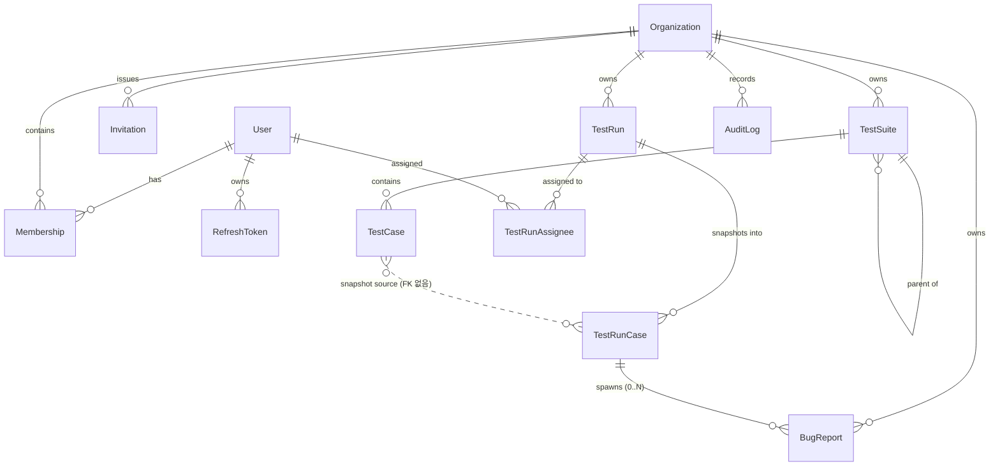

# DATA MODEL — Runboard

Postgres(Neon) + Prisma 6. 용어는 [UBIQUITOUS_LANGUAGE.md](./UBIQUITOUS_LANGUAGE.md), 격리 전략의 배경은 [ARCHITECTURE.md](./ARCHITECTURE.md) 3장.

## 1. 멀티테넌시를 스키마 레벨에서 강제하는 규칙

애플리케이션(가드 + Prisma Extension)이 뚫려도 **DB가 거부**하도록 아래 4개 규칙을 스키마 불변식으로 못박는다.

1. **모든 테넌트 테이블은 `organizationId`를 직접 갖는다.** 부모를 타고 유도할 수 있어도 비정규화해서 들고 있는다.
   - 이유 ①: 모든 조회에 `WHERE organization_id = ?`를 단일 조건으로 붙일 수 있어 Prisma Extension이 모델별 분기 없이 동작한다.
   - 이유 ②: 모든 인덱스의 선두 컬럼을 `organization_id`로 만들 수 있다(테넌트 로컬리티).
2. **부모 테이블은 `@@unique([id, organizationId])`를 갖는다.** 자식이 복합 FK로 참조할 수 있게 하는 앵커.
3. **자식은 부모를 복합 FK `(parentId, organizationId)`로 참조한다.** → 다른 조직의 부모를 가리키는 행은 **DB가 거부**한다. 조직 이동/오염이 구조적으로 불가능.
4. **Prisma DSL이 복합 FK를 표현하지 못하는 자리(부모가 nullable이거나, 한 모델이 두 개의 복합 관계를 필요로 하는 자리)는 마이그레이션 SQL로 제약을 직접 추가한다.**

> **Prisma DSL 한계 (구현 시 주의)**: 한 모델에서 `organizationId` 스칼라를 두 개 이상의 `@relation`에 동시에 쓰거나, 복합 FK의 한쪽만 nullable로 두는 구성은 `prisma validate`가 거부할 수 있다(관련: prisma#6042). 그래서 **모델당 복합 FK는 "필수 부모" 하나(= 테넌트 앵커)만** 선언하고, 나머지 조직 내 참조는 단일 컬럼 FK로 두되 아래 6장 `tenant_integrity` 마이그레이션에서 복합 FK 제약을 SQL로 추가한다. 구현 첫 커밋에서 `npx prisma validate`로 반드시 확인할 것.

**앵커 지도**

| 모델              | 테넌트 앵커(복합 FK 대상) | 비고                                             |
| ----------------- | ------------------------- | ------------------------------------------------ |
| `TestSuite`       | `Organization` (단일 FK)  | `parentId` 자기참조는 6장 SQL에서 복합 FK로 보강 |
| `TestCase`        | `TestSuite` (복합 FK)     | Organization 직접 관계는 두지 않음               |
| `TestRun`         | `Organization` (단일 FK)  |                                                  |
| `TestRunCase`     | `TestRun` (복합 FK)       | 원본 케이스는 **FK 없는 스냅샷 참조**(아래 3장)  |
| `TestRunAssignee` | `TestRun` (복합 FK)       | `userId`는 전역 `User` 단일 FK                   |
| `BugReport`       | `Organization` (단일 FK)  | `testRunCaseId`는 6장 SQL에서 복합 FK로 보강     |
| `Membership`      | `Organization` (단일 FK)  |                                                  |
| `Invitation`      | `Organization` (단일 FK)  |                                                  |
| `AuditLog`        | `Organization` (단일 FK)  |                                                  |

**전역(테넌트 아님) 모델**: `User`, `RefreshToken` — Prisma Extension의 테넌트 주입 대상에서 제외되며, `auth` 모듈과 시드 스크립트만 접근한다.

---

## 2. ERD



---

## 3. Prisma 스키마 초안

```prisma
generator client {
  provider = "prisma-client-js"
}

datasource db {
  provider  = "postgresql"
  url       = env("DATABASE_URL")   // Neon 풀러 (앱 런타임)
  directUrl = env("DIRECT_URL")     // Neon 직결 (migrate/introspect)
}

// ───────── enums ─────────
enum Role          { ADMIN QA_LEAD TESTER VIEWER }
enum InviteStatus  { PENDING ACCEPTED REVOKED EXPIRED }
enum CasePriority  { LOW MEDIUM HIGH CRITICAL }
enum RunStatus     { PLANNED IN_PROGRESS COMPLETED ABORTED }
enum RunCaseResult { PENDING PASS FAIL BLOCKED SKIPPED }
enum BugSeverity   { MINOR MAJOR CRITICAL }
enum BugStatus     { OPEN IN_PROGRESS RESOLVED WONTFIX }

enum AuditAction {
  ORG_CREATED
  MEMBER_INVITED  MEMBER_JOINED  MEMBER_ROLE_CHANGED  MEMBER_REMOVED
  SUITE_CREATED   SUITE_UPDATED  SUITE_DELETED
  CASE_CREATED    CASE_UPDATED   CASE_DELETED
  RUN_CREATED     RUN_STARTED    RUN_COMPLETED  RUN_ABORTED  RUN_ASSIGNEES_CHANGED
  RUNCASE_RESULT_RECORDED
  BUG_CREATED     BUG_STATUS_CHANGED  BUG_UPDATED
  AUTH_LOGIN_SUCCEEDED  AUTH_LOGIN_FAILED  AUTH_REFRESH_REUSE_DETECTED
}

enum AuditTargetType { ORGANIZATION MEMBERSHIP INVITATION TEST_SUITE TEST_CASE TEST_RUN TEST_RUN_CASE BUG_REPORT USER }

// ───────── 전역(테넌트 아님) ─────────
model User {
  id           String   @id @default(uuid(7)) @db.Uuid
  email        String   @unique                       // 데모 계정만 'admin' 리터럴
  passwordHash String
  name         String
  createdAt    DateTime @default(now())
  updatedAt    DateTime @updatedAt

  memberships   Membership[]
  refreshTokens RefreshToken[]
  assignments   TestRunAssignee[]

  @@map("users")
}

model RefreshToken {
  id         String    @id @default(uuid(7)) @db.Uuid
  userId     String    @db.Uuid
  tokenHash  String    @unique                        // SHA-256. 원문은 저장하지 않는다
  familyId   String    @db.Uuid                       // 회전 계열: 재사용 탐지 시 계열 전체 폐기
  expiresAt  DateTime
  revokedAt  DateTime?
  createdAt  DateTime  @default(now())

  user User @relation(fields: [userId], references: [id], onDelete: Cascade)

  @@index([userId, expiresAt])
  @@index([familyId])
  @@map("refresh_tokens")
}

// ───────── 테넌시 ─────────
model Organization {
  id        String   @id @default(uuid(7)) @db.Uuid
  name      String
  slug      String   @unique
  createdAt DateTime @default(now())

  memberships Membership[]
  invitations Invitation[]
  suites      TestSuite[]
  runs        TestRun[]
  bugs        BugReport[]
  auditLogs   AuditLog[]

  @@map("organizations")
}

model Membership {
  id             String   @id @default(uuid(7)) @db.Uuid
  organizationId String   @db.Uuid
  userId         String   @db.Uuid
  role           Role
  createdAt      DateTime @default(now())
  updatedAt      DateTime @updatedAt

  organization Organization @relation(fields: [organizationId], references: [id], onDelete: Cascade)
  user         User         @relation(fields: [userId], references: [id], onDelete: Cascade)

  @@unique([userId, organizationId])          // 요청마다 조회되는 핫 패스: (userId, orgId) 룩업
  @@index([organizationId, role])             // 멤버 목록/역할 필터
  @@map("memberships")
}

model Invitation {
  id             String       @id @default(uuid(7)) @db.Uuid
  organizationId String       @db.Uuid
  email          String
  role           Role
  tokenHash      String       @unique          // 초대 링크 토큰의 해시(메일 발송은 비범위)
  status         InviteStatus @default(PENDING)
  expiresAt      DateTime
  invitedById    String       @db.Uuid
  acceptedAt     DateTime?
  createdAt      DateTime     @default(now())

  organization Organization @relation(fields: [organizationId], references: [id], onDelete: Cascade)

  @@index([organizationId, status, createdAt(sort: Desc)])
  @@index([email, status])
  @@map("invitations")
}

// ───────── 테스트 자산 ─────────
model TestSuite {
  id             String   @id @default(uuid(7)) @db.Uuid
  organizationId String   @db.Uuid
  parentId       String?  @db.Uuid            // 최대 3단계(앱에서 검증) + 6장 SQL에서 복합 FK 보강
  name           String
  description    String?
  position       Int      @default(0)
  createdById    String   @db.Uuid
  createdAt      DateTime @default(now())
  updatedAt      DateTime @updatedAt

  organization Organization @relation(fields: [organizationId], references: [id], onDelete: Cascade)
  parent       TestSuite?   @relation("SuiteTree", fields: [parentId], references: [id], onDelete: Cascade)
  children     TestSuite[]  @relation("SuiteTree")
  cases        TestCase[]

  @@unique([id, organizationId])                     // 자식(TestCase) 복합 FK 앵커
  @@index([organizationId, parentId, position])      // 트리 렌더링 쿼리 1회로 해결
  @@map("test_suites")
}

model TestCase {
  id             String       @id @default(uuid(7)) @db.Uuid
  organizationId String       @db.Uuid
  suiteId        String       @db.Uuid
  title          String
  preconditions  String?
  steps          Json         // [{ order: number, action: string, expected?: string }]
  expectedResult String
  priority       CasePriority @default(MEDIUM)
  createdById    String       @db.Uuid
  createdAt      DateTime     @default(now())
  updatedAt      DateTime     @updatedAt

  // 복합 FK: 다른 조직의 스위트에 케이스를 꽂는 것이 DB 레벨에서 불가능
  suite TestSuite @relation(fields: [suiteId, organizationId], references: [id, organizationId], onDelete: Cascade)

  @@unique([id, organizationId])
  @@index([organizationId, suiteId, priority])
  @@index([organizationId, updatedAt(sort: Desc)])   // "최근 수정된 케이스"
  @@map("test_cases")
}

// ───────── 실행 ─────────
model TestRun {
  id             String    @id @default(uuid(7)) @db.Uuid
  organizationId String    @db.Uuid
  name           String
  description    String?
  status         RunStatus @default(PLANNED)
  createdById    String    @db.Uuid
  startedAt      DateTime?
  completedAt    DateTime?
  createdAt      DateTime  @default(now())
  updatedAt      DateTime  @updatedAt

  // 비정규화 카운터: 결과 기록마다 COUNT(*) 집계를 돌지 않기 위해 같은 트랜잭션에서 증감시킨다
  totalCount   Int @default(0)
  passedCount  Int @default(0)
  failedCount  Int @default(0)
  blockedCount Int @default(0)
  skippedCount Int @default(0)

  organization Organization      @relation(fields: [organizationId], references: [id], onDelete: Cascade)
  runCases     TestRunCase[]
  assignees    TestRunAssignee[]

  @@unique([id, organizationId])
  @@index([organizationId, createdAt(sort: Desc)])   // 대시보드 "최근 실행"
  @@index([organizationId, status])
  @@map("test_runs")
}

model TestRunCase {
  id             String        @id @default(uuid(7)) @db.Uuid
  organizationId String        @db.Uuid
  testRunId      String        @db.Uuid

  // 실행 시점 스냅샷: 원본 케이스가 수정/삭제돼도 과거 실행 기록은 변하지 않아야 한다
  sourceCaseId   String?       @db.Uuid       // FK 없음(의도적) — 원본 삭제와 무관해야 하므로
  title          String
  steps          Json
  expectedResult String
  priority       CasePriority

  result         RunCaseResult @default(PENDING)
  comment        String?
  recordedById   String?       @db.Uuid
  recordedAt     DateTime?
  position       Int           @default(0)
  createdAt      DateTime      @default(now())

  testRun TestRun     @relation(fields: [testRunId, organizationId], references: [id, organizationId], onDelete: Cascade)
  bugs    BugReport[]

  @@unique([id, organizationId])
  @@unique([testRunId, sourceCaseId])                // 같은 실행에 같은 원본 케이스 중복 투입 방지
  @@index([testRunId, position])                     // 실행 화면 목록(정렬 포함)
  @@index([testRunId, result])                       // 결과 필터 / 재집계 복구용
  @@index([organizationId, recordedAt(sort: Desc)])  // 조직 활동 피드
  @@map("test_run_cases")
}

model TestRunAssignee {
  organizationId String   @db.Uuid
  testRunId      String   @db.Uuid
  userId         String   @db.Uuid
  createdAt      DateTime @default(now())

  testRun TestRun @relation(fields: [testRunId, organizationId], references: [id, organizationId], onDelete: Cascade)
  user    User    @relation(fields: [userId], references: [id], onDelete: Cascade)

  @@id([testRunId, userId])                          // 배정 여부 확인 = PK 룩업(가드 핫 패스)
  @@index([userId])                                  // "내게 배정된 실행"
  @@map("test_run_assignees")
}

// ───────── 결함 ─────────
model BugReport {
  id                String      @id @default(uuid(7)) @db.Uuid
  organizationId    String      @db.Uuid
  testRunCaseId     String?     @db.Uuid            // 6장 SQL에서 (testRunCaseId, organizationId) 복합 FK 보강
  title             String
  description       String
  stepsToReproduce  Json                            // RunCase 스냅샷에서 초안 생성 후 수정 가능
  severity          BugSeverity @default(MAJOR)
  status            BugStatus   @default(OPEN)
  reportedById      String      @db.Uuid
  assigneeId        String?     @db.Uuid
  resolvedAt        DateTime?
  createdAt         DateTime    @default(now())
  updatedAt         DateTime    @updatedAt

  organization Organization @relation(fields: [organizationId], references: [id], onDelete: Cascade)
  runCase      TestRunCase? @relation(fields: [testRunCaseId], references: [id], onDelete: SetNull)

  @@index([organizationId, status, createdAt(sort: Desc)])  // 목록 기본 정렬 + 상태 필터
  @@index([organizationId, severity, status])               // 대시보드 "열린 버그(심각도별)"
  @@index([testRunCaseId])
  @@map("bug_reports")
}

// ───────── 감사 ─────────
model AuditLog {
  id             String          @id @default(uuid(7)) @db.Uuid
  organizationId String?         @db.Uuid           // C2에서 nullable로 변경 — 로그인 등 조직 미상 전역 이벤트는 null(AuditService.recordGlobal())
  actorId        String?         @db.Uuid           // 시스템 발생 이벤트는 null
  actorEmail     String?                            // 멤버 제거 후에도 "누구였는지" 보존(스냅샷)
  action         AuditAction
  targetType     AuditTargetType
  targetId       String?         @db.Uuid
  metadata       Json?                              // { field: [before, after] } 형태의 변경분만
  ip             String?
  userAgent      String?
  createdAt      DateTime        @default(now())

  organization Organization? @relation(fields: [organizationId], references: [id], onDelete: Cascade)

  @@index([organizationId, createdAt(sort: Desc)])            // 기본 조회(커서 페이지네이션)
  @@index([organizationId, targetType, targetId])             // "이 케이스의 변경 이력"
  @@index([organizationId, actorId, createdAt(sort: Desc)])   // "이 사람이 한 일"
  @@index([organizationId, action, createdAt(sort: Desc)])    // 액션 필터
  @@map("audit_logs")
}
```

> `uuid(7)`은 시간순 정렬 가능한 UUIDv7(Prisma 5.19+). 인덱스 삽입 로컬리티가 좋아 `createdAt` 보조 정렬 키로도 안정적이다. 사용 중인 Prisma 버전이 지원하지 않으면 `uuid()`로 대체하고 정렬은 `(createdAt, id)`로 고정한다.

---

## 4. 인덱스 설계 근거 (쿼리 → 인덱스 매핑)

| 실제 쿼리                            | 사용 인덱스                                           |
| ------------------------------------ | ----------------------------------------------------- |
| 요청마다 멤버십·역할 확인            | `memberships(userId, organizationId)` unique          |
| 조직 멤버 목록/역할 필터             | `memberships(organizationId, role)`                   |
| 스위트 트리 로딩(조직 전체 한 번에)  | `test_suites(organizationId, parentId, position)`     |
| 스위트별 케이스 목록 + 우선순위 정렬 | `test_cases(organizationId, suiteId, priority)`       |
| 대시보드 최근 실행 10건              | `test_runs(organizationId, createdAt DESC)`           |
| 실행 상세 화면(케이스 목록, 순서)    | `test_run_cases(testRunId, position)`                 |
| 결과 필터 / 카운터 재집계            | `test_run_cases(testRunId, result)`                   |
| 배정 여부 확인(가드)                 | `test_run_assignees` PK `(testRunId, userId)`         |
| 내게 배정된 실행                     | `test_run_assignees(userId)`                          |
| 버그 목록(상태 필터 + 최신순)        | `bug_reports(organizationId, status, createdAt DESC)` |
| 열린 버그 심각도별 카운트            | `bug_reports(organizationId, severity, status)`       |
| 감사로그 조회(커서 + 필터)           | `audit_logs` 4종 복합 인덱스                          |

**모든 인덱스의 선두 컬럼이 `organization_id`(또는 조직 스코프가 이미 결정된 `test_run_id`)** — 테넌트별로 인덱스 스캔 범위가 자연 분할된다.

---

## 5. N+1 · 집계 전략

- **실행 상세**: `testRun` 1회 + `runCases` 1회(`findMany`) = 2쿼리. 케이스마다 원본을 다시 읽지 않는다(스냅샷이라 필요 없다 — 스냅샷 설계의 부수 효과).
- **결과 기록**: `$transaction`에서 (1) `TestRunCase.update` (2) `TestRun.update`로 카운터 증감 (3) `AuditLog.create` = 3쿼리 고정. 실행에 케이스가 500개여도 집계 쿼리가 없다.
  - 카운터 증감은 이전 `result` 값을 읽어 `{ [old]: {decrement:1}, [new]: {increment:1} }`로 원자 갱신(경합 시에도 카운터가 어긋나지 않는다).
  - 복구 경로: `GET /runs/:id/recount`(ADMIN)는 비범위. 대신 통합테스트에서 카운터 정합성을 검증한다.
- **대시보드**: 최근 실행은 카운터 컬럼만 읽어 진행률/통과율 계산(집계 0회), 결과 분포는 `groupBy(['result'])` 1회, 버그는 `groupBy(['severity'])` 1회. 총 3~4쿼리.
- **목록 응답은 `select` 명시** — `steps` 같은 큰 Json은 상세 조회에서만 반환한다.
- **정규화 판단**: `steps`/`stepsToReproduce`는 조회·수정 단위가 항상 부모 레코드 통째이고 개별 스텝을 질의할 일이 없어 `Json`으로 둔다(별도 테이블은 조인만 늘리는 과설계). 반대로 카운터는 의도적 비정규화이며, 그 이유를 코드 주석으로 남긴다.

---

## 6. 마이그레이션 전략

1. `prisma migrate dev --name init` — 위 스키마 전체.
2. `prisma migrate dev --name tenant_integrity --create-only` 후 SQL 직접 추가(DSL이 표현 못 하는 제약 보강):

```sql
-- 스위트 자기참조: 부모가 같은 조직인지 DB가 보장
ALTER TABLE "test_suites"
  ADD CONSTRAINT "test_suites_parent_same_org_fkey"
  FOREIGN KEY ("parentId", "organizationId")
  REFERENCES "test_suites"("id", "organizationId") ON DELETE CASCADE;

-- 버그 → 실행 케이스: 다른 조직의 실행 케이스 참조 차단
ALTER TABLE "bug_reports"
  ADD CONSTRAINT "bug_reports_runcase_same_org_fkey"
  FOREIGN KEY ("testRunCaseId", "organizationId")
  REFERENCES "test_run_cases"("id", "organizationId") ON DELETE SET NULL;

-- 결과가 기록된 RunCase는 기록자·기록시각이 반드시 함께 있어야 한다
ALTER TABLE "test_run_cases"
  ADD CONSTRAINT "test_run_cases_recorded_consistency"
  CHECK ((result = 'PENDING') OR ("recordedById" IS NOT NULL AND "recordedAt" IS NOT NULL));
```

> 기존 단일 컬럼 FK(`test_suites_parentId_fkey`, `bug_reports_testRunCaseId_fkey`)는 중복이므로 같은 마이그레이션에서 `DROP CONSTRAINT`한다. Prisma는 이 제약들을 모델로 인식하지 않지만, 마이그레이션 히스토리에 포함되므로 재현성과 drift 검사에는 문제가 없다.

3. **운영 적용**: 컨테이너 기동 시 `prisma migrate deploy`(Dockerfile CMD). `DIRECT_URL`(Neon 직결)로 실행 — 풀러 뒤에서 DDL을 돌리지 않는다.
4. **롤백 정책**: 프리티어 단일 DB이므로 down 마이그레이션은 두지 않는다. 파괴적 변경(컬럼 삭제/타입 변경)은 확장→백필→축소 3단계로 나눈다는 원칙만 README에 명시.
5. **시드**(`scripts/seed-demo.ts`, idempotent):
   - `admin` **User**(bcrypt `admin`) + 조직 `Runboard QA`(ADMIN) + 조직 `Partner Corp`(VIEWER)
   - `Runboard QA`: 스위트 3(1개는 중첩), 케이스 10, 완료 실행 2 + 진행 중 실행 1(일부 PENDING), 버그 3(OPEN/IN_PROGRESS/RESOLVED), 감사로그 다수
   - `Partner Corp`: **다른 조직 데이터가 안 보인다**는 걸 데모에서 직접 보여주기 위한 별도 자산 세트
   - 실행 방법: `npm run seed:demo`. 이미 `admin`이 있으면 조기 종료.

---

## 7. 데이터 수명

| 데이터             | 삭제 정책                                                                    |
| ------------------ | ---------------------------------------------------------------------------- |
| Organization 삭제  | 전 하위 데이터 cascade (비범위 기능이지만 FK는 미리 정의)                    |
| TestSuite/TestCase | cascade 삭제. 단 **TestRunCase 스냅샷은 남는다**(FK 없음) → 과거 실행 보존   |
| TestRun 삭제       | 비범위(종료/중단만 제공). 감사 추적성 유지 목적                              |
| BugReport          | 삭제 없음, 상태 전이만(WONTFIX)                                              |
| AuditLog           | 불변·삭제 없음. 대량 적재 시 파티셔닝은 향후 과제                            |
| RefreshToken       | 만료·폐기 후에도 재사용 탐지를 위해 만료 +7일까지 보관(정리 스크립트는 향후) |
