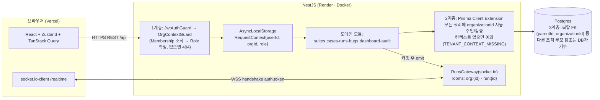
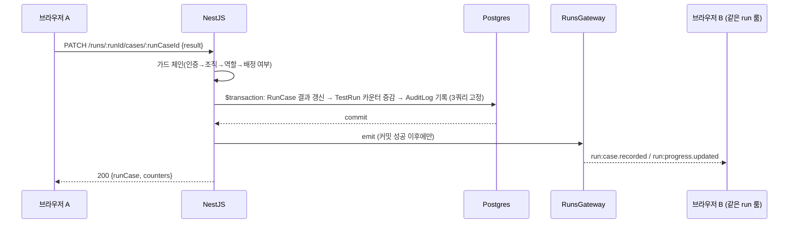

# Runboard

> QA팀용 테스트 케이스·실행(Test Run) 관리 SaaS — 여러 조직이 완전히 격리된 데이터로 함께 쓴다.
> **유형**: 실시간(WebSocket) + 인증/보안 고도화(RBAC + 감사로그) ｜ **난이도**: L(2~3일, 쇼케이스)

[](https://github.com/jakesoneyo/runboard/actions)

🔗 **라이브**: 배포 예정 (프론트 Vercel · 백엔드 Render/Docker · DB Neon — 로컬 시연은 아래 "로컬 실행" 참고)

상세 문서: [SPEC.md](./SPEC.md) · [ARCHITECTURE.md](./ARCHITECTURE.md) · [DATA-MODEL.md](./DATA-MODEL.md) · [API.md](./API.md) · [PLAN.md](./PLAN.md) · [UBIQUITOUS_LANGUAGE.md](./UBIQUITOUS_LANGUAGE.md)

---

## 문제의식

QA팀이 흔히 겪는 다섯 가지: 시트 복사본이라 어느 회차를 돌았는지 모른다 / 동시에 채우면 덮어써진다 / FAIL을 이슈 트래커에 손으로 옮긴다 / 외주 인력에게 다른 고객사 데이터가 새면 안 된다 / "누가 언제 뭘 바꿨는지" 되짚을 수 없다.

Runboard는 **조직 단위 완전 격리 + 역할 기반 접근제어(RBAC) + 실행 시점 스냅샷 + 동시 실행 실시간 동기화 + 감사로그**로 이 다섯 가지를 정면으로 푼다.

## 데모 로그인

로그인 화면의 **`회원가입 없이 둘러보기`** 버튼(보조 설명: `회원가입 없이 체험해 볼 수 있습니다.`)을 누르면 아래 계정으로 바로 들어간다. 회원가입 절차 없이 완성된 화면(대시보드·실행·버그·감사로그)을 즉시 볼 수 있다.

| 계정    | 비밀번호 | Runboard QA | Partner Corp |
| ------- | -------- | ----------- | ------------ |
| `admin` | `admin`  | **ADMIN**   | **VIEWER**   |

같은 사람이 조직마다 다른 Role을 갖는 걸 조직 전환기에서 바로 확인할 수 있다(멀티테넌시 데모). 비밀번호는 여느 계정과 동일하게 bcrypt 비교를 통과해야 로그인된다 — `admin`은 로그인 스키마에서 `email === 'admin'` 리터럴 하나만 이메일 형식 검증을 우회할 뿐, 인증 절차 자체를 우회하지 않는다.

## 기술 스택

| 영역   | 선택                                                                                                    |
| ------ | ------------------------------------------------------------------------------------------------------- |
| 백엔드 | NestJS 11 · Prisma 7(+ `@prisma/adapter-pg`) · Passport-JWT · socket.io · Pino · Zod(nestjs-zod)        |
| 프론트 | Vite · React 19 · TypeScript · Tailwind v4 · Zustand · TanStack Query · Axios · Recharts · lucide-react |
| DB     | Neon Postgres(프로덕션) / Docker Postgres 16(로컬)                                                      |
| 테스트 | Jest + supertest + Testcontainers(백엔드 통합테스트), socket.io-client(실시간 e2e)                      |
| 인프라 | Docker · GitHub Actions CI · Render(백엔드) · Vercel(프론트)                                            |

## 아키텍처

### 조직 스코프 3계층 강제

애플리케이션 계층이 뚫려도 DB가 마지막에 거른다 — 이 3계층이 핵심 설계 결정이다(근거: [ARCHITECTURE.md](./ARCHITECTURE.md) 3장).



### 실시간 흐름 (결과 기록 1건의 수명)

쓰기는 **REST만** 쓰고 소켓은 브로드캐스트 전용이다 — 검증·인가·트랜잭션·감사로그 경로를 하나로 유지하기 위해서다. emit은 **트랜잭션 커밋 이후에만** 나간다(롤백된 상태를 방송하지 않기 위해).



## 핵심 기능

- **멀티테넌시**: `/api/orgs/:orgId/...` 경로 + 3계층 격리. 다른 조직 리소스는 403이 아니라 **404**(존재 은닉).
- **테스트 스위트/케이스**: 최대 3단계 트리, Step 배열 + Expected Result + Priority, 스위트 삭제 시 하위 cascade(단 과거 실행 스냅샷은 보존).
- **테스트 실행 + 실시간 동기화**: 케이스를 RunCase로 스냅샷 복사(원본이 바뀌어도 불변), 여러 명이 같은 실행을 동시에 기록하면 500ms 이내 상호 반영(`run:case.recorded`/`run:progress.updated`/`run:presence.updated`/`run:status.changed`).
- **버그 리포트 연동**: FAIL RunCase에서 제목/재현 스텝 초안을 자동 생성, 상태(OPEN/IN_PROGRESS/RESOLVED/WONTFIX) 관리.
- **RBAC**: Role은 토큰이 아니라 요청 시점 Membership 조회로 결정 — 강등/추방이 토큰 만료를 기다리지 않고 즉시 반영된다.
- **감사로그**: 도메인 트랜잭션과 같은 트랜잭션 안에서 기록(불변, 수정·삭제 API 없음), ADMIN 전용 필터+커서 페이지네이션 조회.
- **대시보드**: 최근 실행·통과율 추이·결과 분포·열린 버그(Severity별) — 비정규화 카운터로 N+1 없이 집계.
- **데모 로그인**: 위 "데모 로그인" 절 참고.

## 로컬 실행

사전 준비: Node 20+, Docker(로컬 Postgres용).

```bash
# 1) 로컬 Postgres (예: docker run으로 5432/원하는 포트에 postgres:16-alpine 실행)

# 2) 백엔드
cd backend
cp .env.example .env            # DATABASE_URL/DIRECT_URL/JWT_SECRET 등 값 채우기
npm install
npx prisma migrate deploy       # 마이그레이션 적용
npm run seed:demo               # 데모 계정·샘플 데이터 시드(idempotent)
npm run start:dev               # http://localhost:3000 (Swagger: /api/docs, 헬스체크: /health)

# 3) 프론트 (새 터미널)
cd frontend
cp .env.example .env            # VITE_API_URL/VITE_WS_URL 값 채우기(기본값이 로컬 백엔드를 가리킨다)
npm install
npm run dev                     # http://localhost:5173
```

브라우저에서 `admin` / `admin`으로 로그인(또는 `회원가입 없이 둘러보기` 버튼)하면 채워진 대시보드로 진입한다.

## 배포

- **백엔드(Render)**: `render.yaml` Blueprint 연결 후 대시보드에서 `DATABASE_URL`·`DIRECT_URL`(Neon 직결/non-pooled)·`JWT_SECRET`·`CORS_ORIGINS`(배포된 Vercel 도메인, 콤마 구분 가능)·`FRONTEND_URL`을 `sync: false` 값으로 채운다. `CORS_ORIGINS`가 비어 있으면 프로덕션에서 서버가 기동 즉시 실패한다(`backend/src/common/config/cors.config.ts`) — 전체 허용으로 조용히 열리는 사고를 방지하기 위한 의도된 동작이다.
- **프론트(Vercel)**: `VITE_API_URL`(`https://<render-host>/api`)과 `VITE_WS_URL`(`https://<render-host>`)을 **Vercel 프로젝트 환경변수로 빌드 전에** 등록해야 한다 — Vite는 빌드타임에 `import.meta.env`를 치환하므로 배포 후 런타임에 값을 바꿀 수 없다(다시 빌드해야 반영됨).
- **데모 시드(필수, 1회)**: Render는 무료 플랜이라 배포 후 셸 접근이 없고, 프로덕션 이미지는 `npm prune --omit=dev`로 `ts-node`를 지워서 컨테이너 안에서 시드를 못 돌린다. 대신 **로컬 머신에서 Neon을 직접 향해** 실행한다 — idempotent라 재실행해도 안전하다.
  ```bash
  cd backend
  DATABASE_URL='<neon-pooled-url>' DIRECT_URL='<neon-direct-url>' npm run seed:demo
  ```
  이 단계 없이는 `admin`/`admin` 로그인이 401로 실패한다(마이그레이션만으로는 계정이 생기지 않음).

## API 문서

Swagger: 로컬 `http://localhost:3000/api/docs` (라이브 배포 후 이 절에 URL 추가 예정). 모든 엔드포인트에 요청/응답 DTO와 요구 Role이 노출된다.

## 테스트 / 빌드

```bash
# 백엔드 — 단위 테스트
cd backend && npm run test:unit
# 백엔드 — 통합 테스트(Testcontainers로 실제 Postgres 컨테이너를 띄운다, Docker 필요)
cd backend && npm run test:e2e
# 백엔드 — 빌드/타입체크
cd backend && npm run build && npm run typecheck

# 프론트 — 빌드/타입체크
cd frontend && npm run build

# 워크스페이스 루트에서 한 번에(백엔드 단위테스트 + 두 워크스페이스 typecheck)
npm test && npm run typecheck
```

Docker 이미지 빌드/실행:

```bash
cd backend
docker build -t runboard-backend .
docker run --env-file .env -p 3000:3000 runboard-backend   # 컨테이너 기동 시 prisma migrate deploy 자동 실행
```

## 왜 안 만들었나 (비범위)

L티어 2~3일 안에 멀티테넌시·RBAC·실시간·감사로그를 **깊게** 끝내기 위해 아래는 명시적으로 제외했다(전체 근거는 [SPEC.md](./SPEC.md) 4장).

| 제외 항목                          | 이유                                                                                                                      |
| ---------------------------------- | ------------------------------------------------------------------------------------------------------------------------- |
| 파일/스크린샷 첨부                 | 오브젝트 스토리지·서명 URL·용량 정책까지 붙어 하루가 통째로 나간다. 이번 프로젝트의 증명 대상(실시간·RBAC)에 기여가 없다. |
| 실시간 채팅/코멘트 스레드          | 실행 결과 브로드캐스트로 실시간 역량은 이미 증명된다. 같은 기술의 반복.                                                   |
| 이메일 발송(초대·비번 재설정)      | SMTP·전송 실패 처리는 인프라 작업. 초대는 링크 토큰 복사 방식으로 대체.                                                   |
| 소셜 로그인(OAuth/SSO), 2FA        | Passport-JWT + 리프레시 회전/재사용 탐지로 인증 깊이는 충분.                                                              |
| 낙관적 잠금(버전 충돌 UI)          | LWW + "누가 방금 덮었는지" 실시간 표시로 실사용 문제를 해결. 충돌 UX는 과설계.                                            |
| 케이스 버전 히스토리 diff 뷰어     | 실행 스냅샷 + 감사로그 metadata(before/after)로 추적 가능.                                                                |
| JUnit/XML 자동화 결과 임포트       | 파서·매핑 규칙이 별도 도메인. 수동 실행 흐름이 실시간 데모의 본질.                                                        |
| Jira/GitHub Issues 연동            | 외부 API 연동은 다른 유형 태그라 정체성이 흐려진다.                                                                       |
| 결제·플랜·조직 사용량 제한         | SaaS 과금은 도메인 밖.                                                                                                    |
| 알림 센터/이메일 알림              | 실시간 이벤트로 화면에서 이미 보인다.                                                                                     |
| Postgres RLS(행 수준 보안)         | Neon 풀러 + Prisma에서 세션 변수 관리 비용이 크다. 애플리케이션 3계층으로 대체(향후 과제로 아래 명시).                    |
| WebSocket 수평 확장(Redis adapter) | Render 무료 인스턴스 1대 기준. 확장 지점만 아래에 명시.                                                                   |
| i18n, 모바일 앱, 다크모드 토글     | 포트폴리오 평가 축에 기여하지 않는다(UI는 한국어 단일, 반응형만 보장).                                                    |
| CSV 임포트/엑스포트                | 시간 대비 임팩트 낮음. 시드 데이터로 화면을 충분히 채운다.                                                                |

## 향후 과제

- **Postgres RLS(`SET LOCAL app.current_org`)**: 가장 강력한 4번째 방어선이지만 Neon 풀러 뒤에서 세션 변수를 안전히 쓰려면 모든 쿼리를 트랜잭션으로 감싸야 한다. 지금은 애플리케이션 3계층(가드 + Prisma Extension + DB 복합 FK)으로 충분히 방어하고 있다는 판단(근거: [ARCHITECTURE.md](./ARCHITECTURE.md) 3장 "기각한 대안").
- **`@socket.io/redis-adapter` 도입**: 지금은 인스턴스 1대 전제로 프레즌스를 인메모리에 둔다. 인스턴스를 늘리면 룸 상태 공유를 위해 Redis adapter가 필요하다.
- **낙관적 잠금 / 버전 충돌 UI**: 현재는 LWW(마지막 기록이 이긴다) + `recordedBy`/`recordedAt` 실시간 표시로 대응한다. 팀 규모가 커지면 버전 충돌 UX가 필요해질 수 있다.
- **감사로그 파티셔닝**: 불변·삭제 없음 정책상 장기적으로 테이블이 계속 커진다. 대량 적재 시점에 `createdAt` 기준 파티셔닝을 고려한다.
- **RefreshToken 정리 스크립트**: 만료 +7일까지는 재사용 탐지를 위해 보관하는데, 그 이후 정리 배치는 아직 없다.

## 리스크 대응

- Render 무료 인스턴스 슬립 → 첫 진입이 느릴 수 있다(README·프론트 로딩 상태로 안내, `/health` 워밍업 호출 권장).
- Neon 풀러 커넥션 한계 → `connection_limit` 축소, 마이그레이션은 `DIRECT_URL`(직결)만 사용.
- WebSocket이 프록시에서 끊기면 → 클라이언트가 자동 재연결 후 REST로 전체 상태 재조회(이벤트 유실 복구 경로).
