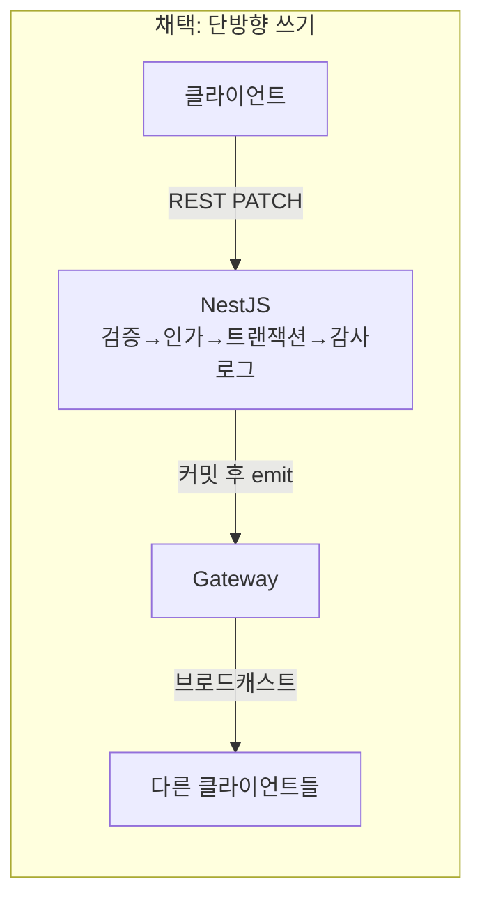
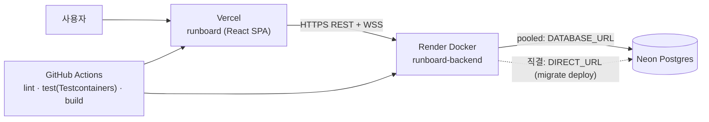

# STUDY — Runboard 학습 가이드 (2부)

> [1부(STUDY.md)](./STUDY.md)에서 이어진다. 1부는 요약·아키텍처·기술 해설·핵심 설계 결정(멀티테넌시/RBAC/감사로그/인증/데이터모델)을 다뤘다.
> 2부는 **실시간 · 성능 · 실제로 겪은 버그 · 배포 · 검수 프로세스 · 한계 · 학습 로드맵**이다.

---

## 목차 (2부)

9. [핵심 설계 결정 ⑥ — 실시간 아키텍처](#9-핵심-설계-결정--실시간-아키텍처)
10. [성능 — N+1 회피와 쿼리 예산](#10-성능--n1-회피와-쿼리-예산)
11. [★실제로 겪은 버그·함정 7선 (면접 스토리 원재료)](#11-실제로-겪은-버그함정-7선-면접-스토리-원재료)
12. [배포 · 인프라](#12-배포--인프라)
13. [검수(REVIEW) 프로세스 자체가 산출물이다](#13-검수review-프로세스-자체가-산출물이다)
14. [데모 계정 패턴이 왜 안전한가](#14-데모-계정-패턴이-왜-안전한가)
15. [남아 있는 한계 (알고 남긴 것)](#15-남아-있는-한계-알고-남긴-것)
16. [학습 로드맵 체크리스트](#16-학습-로드맵-체크리스트)
17. [직접 해보는 실습 과제](#17-직접-해보는-실습-과제)

---

## 9. 핵심 설계 결정 ⑥ — 실시간 아키텍처

### 9.1 결정 1: 쓰기는 REST만, 소켓은 브로드캐스트 전용

WebSocket을 쓰면 "그냥 소켓으로 결과도 보내지" 하고 싶어진다. **의도적으로 안 했다.**



이유는 **경로를 하나로 유지하기 위해서**다. 쓰기를 소켓으로도 허용하면 같은 규칙을 **두 번** 구현해야 한다.

| 규칙              | REST 경로                        | 소켓으로도 쓰기를 허용하면?                |
| ----------------- | -------------------------------- | ------------------------------------------ |
| 입력 검증         | `ZodValidationPipe`(전역 파이프) | 게이트웨이용 검증을 따로 짜야 함           |
| 인가              | 가드 체인 4단계                  | 소켓용 인가를 따로 짜야 함 → **누락 위험** |
| 트랜잭션          | 서비스가 `tx.run(...)`           | 중복                                       |
| 감사로그          | 트랜잭션 내부 `record()`         | **여기서 빠지는 사고가 실제로 잦다**       |
| API 문서(Swagger) | 자동                             | 소켓은 자동 문서화가 없다                  |

"둘 중 하나에서 감사로그가 빠지는 사고"는 가상의 얘기가 아니라 실무에서 흔한 패턴이다. **소켓을 읽기 전용 채널로 못 박은 것 자체가 설계 결정**이다.

### 9.2 결정 2: emit은 트랜잭션 커밋 이후에만

```ts
// runs.service.ts — 구조가 곧 보장이다
const outcome = await this.tx.run(async (tx) => { /* update · 카운터 · 감사로그 */ });
// ↑ 여기서 예외가 나면 아래 줄에 "도달조차 못 한다"
const counters = computeCounters(outcome.updatedRun);
this.events.emitCaseRecorded(runId, {...});
this.events.emitProgressUpdated(runId, counters);
```

**트랜잭션 안에서 emit하면 무슨 일이 나나.** 커밋되기 전에 방송이 나가고, 그 뒤 롤백되면 **존재하지 않는 상태가 다른 사용자 화면에 남는다.** 그 화면은 새로고침 전까지 거짓말을 한다. 되돌릴 방법도 없다(이미 나간 메시지는 회수 불가).

**테스트로 증명한 것(T-16)** — 이게 이 프로젝트에서 가장 자랑할 만한 테스트다.

```ts
const spy = jest.spyOn(auditService, 'record')
  .mockRejectedValueOnce(new Error('의도적으로 주입한 감사로그 실패'));

const [res] = await Promise.all([
  authed(qaLead).patch(`/api/orgs/${orgA.id}/runs/${runId}/cases/${runCaseId}`).send({ result: 'FAIL' }),
  assertNoEvent(watcherSocket, 'run:case.recorded', 1000),   // 1초간 이벤트가 안 오는 걸 확인
]);
expect(res.status).toBe(500);
expect((await prisma.testRunCase.findUnique(...))?.result).toBe('PENDING');  // 롤백됨
expect((await prisma.testRun.findUnique(...))?.failedCount).toBe(0);          // 카운터도 롤백됨
```

**세 가지가 동시에 검증된다**: ① DB 변경이 롤백됐다 ② 카운터도 함께 롤백됐다 ③ 소켓 이벤트가 나가지 않았다. 목이 아니라 **실제 Postgres + 실제 소켓 연결**로 확인했기 때문에 의미가 있다.

**구조적 보강**: `run-events.service.ts`는 트랜잭션을 **아예 import하지 않는다**. 그래서 "커밋 전에 emit"하는 코드가 그 파일에 섞여들 수가 없다. 규칙을 주석이 아니라 **의존 방향**으로 강제한 것.

### 9.3 결정 3: WebSocket이 REST의 인가 로직을 재사용한다

**소켓에서 가장 흔한 사고**: "룸 이름만 알면 남의 데이터를 훔쳐본다."

`run:join { runId }`를 받아서 그냥 `socket.join('run:' + runId)`를 해버리면, 다른 조직 사람도 runId만 알면 그 실행의 모든 결과 기록을 실시간으로 받아본다. REST는 404로 완벽히 막고 있는데 소켓으로 우회되는 것이다.

```ts
// runs.gateway.ts
const allowed = await this.runs.assertReadable(body.orgId, body.runId, userId);
if (!allowed) return { ok: false, code: "NOT_FOUND" };
await socket.join(`run:${body.runId}`);
```

```ts
// runs.service.ts — REST가 쓰는 것과 같은 서비스, 같은 판단
async assertReadable(organizationId, runId, userId) {
  if (!(await this.isOrgMember(organizationId, userId))) return false;
  const run = await this.rawPrisma.testRun.findUnique({ where: { id: runId } });
  return run?.organizationId === organizationId;
}
```

**"소켓이라고 검사를 건너뛰지 않는다"**가 원칙이고, 그걸 **같은 서비스 메서드 재사용**으로 구현했다. 인가 로직이 두 벌이면 한쪽만 고치는 사고가 난다.

**핸드셰이크 인증**도 REST와 같은 시크릿·같은 payload 모양을 검증한다.

```ts
namespace.use((socket, next) => {
  this.authenticate(socket)
    .then(() => next())
    .catch(() => next(new Error("인증에 실패했습니다.")));
});
```

- **핸드셰이크에서만 인증**하고, 이후 이벤트는 `socket.data`(이미 인증된 값)를 신뢰한다.
- `next(err)`로 거부하면 socket.io가 연결을 끊는다.
- 클라이언트는 `auth`를 **함수**로 넘겨서 재연결 때마다 최신 토큰을 읽는다 — access가 15분마다 갱신돼도 소켓이 자동으로 새 토큰으로 재연결된다.

```ts
// frontend/src/lib/socket.ts
auth: (callback) => {
  callback({ token: useAuthStore.getState().accessToken });
};
```

### 9.4 룸 설계와 프레즌스

| 룸            | 조인 조건                             | 용도                                      |
| ------------- | ------------------------------------- | ----------------------------------------- |
| `org:{orgId}` | 해당 조직의 Membership 보유           | 조직 단위 알림(버그 생성/수정, 실행 상태) |
| `run:{runId}` | 그 실행이 속한 조직의 Membership 보유 | 실행 화면 동기화 + 프레즌스               |

`run:status.changed`는 **두 룸 모두**에 나간다 — 실행 화면을 보고 있는 사람도, 대시보드/목록을 보고 있는 사람도 갱신돼야 하기 때문.

**프레즌스(누가 지금 이 화면을 보고 있나)는 인메모리**다. DB에 안 쓴다.

- 이유: 프레즌스는 **휘발성 상태**다. 서버가 죽으면 어차피 무의미하고, DB에 쓰면 접속/이탈마다 쓰기가 발생한다.
- 전제: **인스턴스 1대**. 확장하면 인스턴스마다 다른 프레즌스를 갖게 되므로 `@socket.io/redis-adapter`가 필요하다 — 이 확장 지점을 README에 명시했다.

### 9.5 클라이언트 규칙 — 캐시 패치와 유실 복구

```ts
// use-run-socket.ts
function join() {
  socket.emit("run:join", { orgId, runId }, (ack) => {
    if (ack.ok && ack.participants) setParticipants(ack.participants);
  });
  if (hasJoinedOnceRef.current) {
    // ★ "재연결"일 때만 재조회
    queryClient.invalidateQueries({ queryKey: runDetailKey(orgId, runId) });
    queryClient.invalidateQueries({ queryKey: runCasesKey(orgId, runId) });
  }
  hasJoinedOnceRef.current = true;
}
```

- **평소**: 이벤트를 받아 `setQueryData`로 **해당 항목만 패치**한다(전체 재조회 금지). 500개짜리 실행에서 결과 하나 바뀔 때마다 전체를 다시 받으면 실시간의 의미가 없다.
- **재연결 시에만** `invalidateQueries`로 REST 전체 재조회 → **끊긴 동안 놓친 이벤트를 복구**한다.
- 최초 조인은 `useQuery`가 이미 최신 데이터를 가져온 직후라 재조회가 낭비다 → `hasJoinedOnceRef`로 구분.

**이게 실시간 시스템의 일반 패턴이다**: 이벤트는 **최적화**이고, 정합성의 근거는 **REST(서버 상태)** 다. 이벤트를 신뢰의 유일한 근거로 삼으면 유실 시 복구 경로가 없다.

또 하나: 다른 사람이 기록하면 `"OOO님이 방금 PASS 기록"` 토스트가 뜬다(내가 한 건 제외). LWW(마지막 기록이 이긴다) 정책을 택하면서 **"누가 방금 덮었는지가 화면에 보이는 것"** 으로 실사용 문제를 해결한 것 — 낙관적 잠금 UI를 만들지 않은 근거다.

---

## 10. 성능 — N+1 회피와 쿼리 예산

### 10.1 N+1이 뭔가

목록 N건을 가져온 뒤, 각 건마다 관련 데이터를 1번씩 더 조회하는 패턴. 1 + N 쿼리가 나간다.

```ts
const suites = await prisma.testSuite.findMany(); // 1
for (const s of suites)
  s.children = await prisma.testSuite.findMany({ where: { parentId: s.id } }); // N
```

**왜 위험한가**: 로컬(DB가 같은 머신)에선 안 느껴진다. 프로덕션에서 DB가 네트워크 너머에 있으면 **쿼리 1개당 왕복 지연이 곱해진다**. 100건이면 100번의 왕복.

### 10.2 이 프로젝트가 N+1을 막은 3가지 방식

**① 스위트 트리 — 1쿼리 + 메모리 조립**

```ts
// assemble-suite-tree.ts — 평면 배열을 받아 Map으로 부모-자식을 잇는다
const byId = new Map(nodes.map((n) => [n.id, { ...n, children: [] }]));
for (const n of nodes) {
  const parent = n.parentId ? byId.get(n.parentId) : undefined;
  if (parent) parent.children.push(byId.get(n.id)!);
  else roots.push(byId.get(n.id)!);
}
```

재귀 쿼리(`WITH RECURSIVE`)도, 자식별 `findMany`도 쓰지 않는다. 조직 전체 스위트를 **한 번에 평면 조회**하고 O(N)으로 조립한다. 최대 깊이가 3단계고 조직당 스위트 수가 적다는 전제가 명확해서 가능한 선택이다.

같은 데이터로 트리 **규칙 검증**(최대 깊이·순환 참조)도 한다 — `ancestorChain`, `exceedsMaxDepth`, `createsCycle`이 전부 **엣지 배열만 받는 순수 함수**라 DB 접근이 0이고 단위테스트가 쉽다.

**② 대시보드 — 4쿼리 고정**

```ts
const [statusGroups, casesTotal, openBugGroups, recentRuns] = await Promise.all([
  prisma.testRun.groupBy({ by: ['status'], _count: {_all: true}, _sum: { totalCount: true, passedCount: true, ... } }),
  prisma.testCase.count(),
  prisma.bugReport.groupBy({ by: ['severity'], _count: {_all: true}, where: { status: { in: OPEN_BUG_STATUSES } } }),
  prisma.testRun.findMany({ orderBy: {createdAt:'desc'}, take: 5, select: { /* 스칼라만 */ } }),
]);
```

포인트 세 개:

- **`groupBy` + `_sum`으로 비정규화 카운터를 재사용** → "실행 상태별 개수"와 "결과 분포"를 **같은 쿼리 하나**로 얻는다. `TestRunCase`를 다시 집계하지 않는다.
- **`include` 대신 `select`** — 최근 실행에 `assignees`를 include하면 Prisma가 has-many 관계를 **별도 배치 쿼리**로 로딩해 쿼리가 2~3개 늘어난다. "최근 실행 카드"엔 담당자가 필요 없으므로 스칼라만 뽑아 1쿼리로 끝낸다. **쿼리 예산을 지키려고 응답 필드를 줄인 의도적 선택.**
- `Promise.all`로 4개를 병렬 실행.

**③ 배치 조회 + Map** — `listCases`에서 `recordedBy` 이름을 붙일 때

```ts
const recorderIds = [
  ...new Set(runCases.map((c) => c.recordedById).filter(Boolean)),
];
const recorders = await this.rawPrisma.user.findMany({
  where: { id: { in: recorderIds } },
  select: { id: true, name: true },
});
const recorderNameById = new Map(recorders.map((u) => [u.id, u.name]));
```

케이스마다 `findUnique`를 부르는 대신 **id를 모아 한 번에 `IN` 조회 후 Map으로 매핑**한다. `TestRunCase.recordedById`에 User 관계가 없는 이유(스냅샷이라 FK를 최소화)와 맞물린 처리.

### 10.3 쿼리 수를 "테스트로" 잠근 것 ★

주장으로 끝내지 않고 **실제 SQL 왕복 수를 세는 유틸**을 만들었다.

```ts
// test/support/query-counter.ts
export function attachQueryCounter(prisma: PrismaService): QueryCounter {
  let count = 0;
  prisma.$on("query", () => {
    count += 1;
  });
  return {
    reset: () => {
      count = 0;
    },
    get count() {
      return count;
    },
  };
}
```

동작 원리:

- `PrismaService`가 `log: [{ emit: 'event', level: 'query' }]`로 쿼리 이벤트를 열어둔다(리스너가 없으면 비용 없음).
- `$extends`는 **같은 엔진 인스턴스를 감쌀 뿐**이라, 원본에 건 리스너가 `TENANT_PRISMA` 경유 쿼리까지 전부 잡는다.

이게 있으면 "N+1을 막았다"가 **회귀 테스트로 고정**된다. 나중에 누가 `include`를 추가해 쿼리가 늘면 테스트가 깨진다.

### 10.4 커서 페이지네이션

```ts
take: query.take + 1,                                   // 1건 더 받아서 hasMore 판정
...(query.cursor ? { cursor: { id: query.cursor }, skip: 1 } : {}),
```

**오프셋(`OFFSET 1000`) 대신 커서를 쓰는 이유**: 오프셋은 DB가 앞의 1000행을 **읽고 버려야** 해서 뒤로 갈수록 느려진다. 커서는 "이 id 다음부터"라 인덱스로 바로 점프한다. 그리고 페이지를 넘기는 동안 새 데이터가 삽입돼도 **중복/누락이 없다**.

`take + 1`로 한 건 더 받아 `hasMore`를 판정하는 건 "다음 페이지가 있나?"를 위해 `count(*)`를 따로 안 돌리기 위한 관용 기법이다.

> ⚠️ **알고 있는 한계(검수 🟡)**: 정렬 키는 `createdAt`인데 커서 키는 `id`다. 같은 타임스탬프 레코드가 여럿이면(한 트랜잭션에서 감사로그가 여러 건 생기는 경우 **실제로 발생**) 페이지 경계에서 중복/누락이 가능하다. 정답은 `orderBy: [{ createdAt: 'desc' }, { id: 'desc' }]`로 **타이브레이커를 추가**하는 것. UUIDv7이라 id 정렬이 대체로 시간순과 일치해 증상이 잘 안 드러나지만, **보장은 아니다.**

---

## 11. ★실제로 겪은 버그·함정 7선 (면접 스토리 원재료)

각 항목은 **증상 → 원인 → 해결 → 배운 것(일반화)** 순서다. 면접에서는 이 4단으로 말하면 STAR 구조가 자동으로 나온다.

### 11-1. 같은 결과를 두 번 기록하면 카운터가 이중 증가 (배포 블로커 🔴-1)

**증상.** 실행에 케이스 1개, PASS를 두 번 누르면 `totalCount: 1, passedCount: 2`. 진행률 200%, 통과율 200%가 화면에 뜬다. UI가 동일 결과 재클릭을 막지 않으므로(코멘트만 수정하는 경우도 같은 경로) **면접관이 PASS를 두 번 누르면 대시보드가 깨진다.**

**원인.** 카운터 이동을 이렇게 만들었다.

```ts
const data: Prisma.TestRunUpdateInput = {};
if (prevField) data[prevField] = { decrement: 1 };
if (nextField) data[nextField] = { increment: 1 }; // ← prevField === nextField면 decrement가 덮인다
```

JS 객체는 같은 키에 두 번 할당하면 **뒤엣것이 이긴다**. PASS→PASS면 `data.passedCount`가 `{decrement:1}` → `{increment:1}`로 덮여 **감소가 사라진다**. 심지어 주석에는 "같은 필드로 상쇄되는 경우도 자연히 처리된다"고 적혀 있었다 — **주석이 틀린 사실을 단언하고 있어서 더 위험했다.**

**왜 테스트가 못 잡았나.** 기존 테스트는 `FAIL → PASS`처럼 **서로 다른 필드로 전이하는 경우만** 검증했다. 같은 필드 전이는 테스트 케이스에 없었다. **"테스트가 그린인 것과 버그가 없는 것은 다르다"**의 교과서적 사례.

**해결.** 증감을 **delta로 먼저 누적**한 뒤 0이 아닌 필드만 반영한다.

```ts
const delta: Partial<Record<CounterField, number>> = {};
if (prevField) delta[prevField] = (delta[prevField] ?? 0) - 1;
if (nextField) delta[nextField] = (delta[nextField] ?? 0) + 1;

const data: Prisma.TestRunUpdateInput = {};
for (const [field, value] of Object.entries(delta)) {
  if (value === 0) continue;
  data[field] = value > 0 ? { increment: value } : { decrement: -value };
}
if (Object.keys(data).length === 0)
  return tx.testRun.findUniqueOrThrow({ where: { id: runId } });
return tx.testRun.update({ where: { id: runId }, data });
```

"조기 반환으로 같은 필드면 스킵"도 가능했지만 **delta 누적 방식**을 택했다. 이유: 특수 케이스를 분기로 처리하면 나중에 또 다른 특수 케이스(예: 한 번에 여러 케이스 결과 반영)가 생겼을 때 분기가 늘어난다. delta는 **일반화된 형태**라 그런 확장에도 그대로 맞는다.

**방어선 하나 더.** `computeCounters`에서 `progress`/`passRate`를 **0~1로 clamp**했다.

```ts
const clamp01 = (v: number) => Math.min(1, Math.max(0, v));
```

주석에 "근본 수정은 카운터 계산 쪽에서 하고, 이건 미래에 유사 회귀가 섞여도 100%를 넘는 값이 화면에 노출되지 않게 하는 마지막 방어선"이라고 명시했다. **clamp를 근본 해결로 착각하지 않았다**는 걸 보여주는 지점.

**회귀 테스트를 추가했다.**

```ts
it('같은 결과(PASS)를 재기록해도 카운터가 이중 증가하지 않는다', async () => { ... expect(counters.passedCount).toBe(1); ... });
```

**배운 것.** ① 상태 전이 로직은 **"같은 상태로의 전이(self-transition)"** 를 반드시 테스트 케이스에 넣어야 한다. ② 주석이 코드의 동작을 단언할 때는 그 단언을 테스트로 잠가야 한다 — 안 그러면 주석이 **오히려 리뷰를 통과시키는 근거**가 된다.

### 11-2. Prisma 스키마 drift — `migrate dev`가 손으로 넣은 복합 FK를 되돌린다

**증상.** `AuditLog.organizationId`를 nullable로 바꾸려고 `prisma migrate dev`를 돌렸더니, 생성된 마이그레이션에 **내가 요청하지 않은 SQL**이 섞여 있었다. 3계층 방어선인 복합 FK(`test_suites_parent_same_org_fkey`, `bug_reports_runcase_same_org_fkey`)를 DROP하고 **단일 컬럼 FK로 되돌리는** 내용이었다.

**원인.** Prisma의 **drift(표류) 검사** 방식을 이해해야 한다.

- `migrate dev`는 "`schema.prisma`가 정답"이라고 가정하고, 현재 DB 상태와 **차이(diff)** 를 계산해 마이그레이션을 만든다.
- 그런데 **복합 FK는 Prisma DSL이 표현하지 못하는 제약**이라 스키마 파일에 없다.
- 그래서 Prisma 입장에서는 "DB에 스키마엔 없는 제약이 붙어 있다" = **drift** → "정답(스키마)에 맞춰 되돌리자"고 판단한다.

즉 **Prisma가 모르는 제약을 DB에 직접 추가했다면, 이후 자동 마이그레이션 생성이 그걸 지운다.**

**해결.** 이후 모든 마이그레이션은 **`--create-only`로 생성하고 SQL을 직접 검토·수정**한다. 그리고 그 이유를 마이그레이션 파일 최상단에 남겼다.

```sql
-- 주의(구현 중 실제로 겪은 함정): 이 파일은 `prisma migrate dev --create-only`가 아니라 손으로 작성했다.
-- `migrate dev`(non-create-only)를 이 스키마에서 그냥 돌리면 Prisma가 6장 SQL로 보강한 복합 FK를
-- "drift"로 오인해 단일 컬럼 FK로 되돌려버린다(Prisma DSL이 그 제약을 모델로 인식하지 못하기 때문).
ALTER TABLE "audit_logs" ALTER COLUMN "organizationId" DROP NOT NULL;
```

**왜 이게 무서운 버그인가.** 이 drift는 **조용히 일어난다.** 마이그레이션은 성공하고, 테스트도 대부분 통과한다(앱 계층 2계층이 여전히 막아주니까). 3계층 방어선만 소리 없이 사라진다. 마이그레이션 SQL을 눈으로 읽지 않으면 못 잡는다.

**배운 것.** **"ORM이 관리하지 않는 DB 객체를 만들었다면, ORM의 자동 생성물을 신뢰하면 안 된다."** 이건 Prisma만의 문제가 아니라 모든 마이그레이션 도구의 공통 성질이다(Flyway·TypeORM도 유사 상황이 있다). 그리고 마이그레이션 파일은 **생성물이 아니라 리뷰 대상 코드**다.

### 11-3. Docker에서만 `npm ci`가 실패한다 — npm 10 vs 11

**증상.** 호스트(npm 11.6.2)에서는 `npm ci`가 잘 되는데, `node:22-alpine` 이미지 안에서만 **EUSAGE 에러**로 실패한다. 락파일 정합성 문제라는데 로컬에선 재현이 안 된다.

**원인 추적.**

1. 에러가 가리키는 대상이 `@emnapi/*` 패키지였다 — jest-resolve가 끌어오는 **wasm32-wasi 바인딩**.
2. 이건 **optionalDependencies 서브트리**이고, 어떤 플랫폼에서도 실제로 설치되지 않는(도달 불가능한) 노드였다.
3. `package.json`에 `overrides`를 넣어봤지만, **npm 10에서는 여전히 실패하고 npm 11에서는 통과**했다.
4. 확인 결과 `node:22-alpine`이 내장한 npm은 **10.9.8**, 호스트는 **11.6.2**. npm 10의 락파일 정합성 검사가 도달 불가능한 optional 서브트리를 **오판**하는 것이었다.

**해결.** 이미지 안의 npm을 호스트와 같은 메이저로 올려 **검증 로직 자체를 맞췄다.**

```dockerfile
FROM node:22-alpine AS builder
# node:22-alpine은 npm 10을 내장하는데, npm 10의 lockfile 정합성 검사는 도달 불가능한
# optionalDependencies 서브트리(@emnapi/* — jest-resolve가 끌어오는 wasm32-wasi 바인딩,
# 어떤 플랫폼에서도 실제 설치되지 않음)를 오판해 `npm ci`를 EUSAGE로 실패시킨다.
# (호스트 npm 11.6.2 dry-run은 통과, Docker 이미지 npm 10.9.8은 실패)
RUN npm install -g npm@11.6.2
```

**배운 것.** ① **"로컬은 되는데 CI/Docker만 안 된다"면 런타임 버전 차이를 먼저 의심한다.** Node 버전은 다들 고정하는데 **npm 버전은 이미지에 딸려오는 걸 그냥 쓴다** — 여기가 사각지대였다. ② `overrides`처럼 "고쳐질 것 같은" 처방을 시도한 뒤 **여전히 실패하면 처방이 아니라 진단을 다시 해야 한다.** ③ Dockerfile 주석에 **원인 분석과 실측 버전 번호**를 남겨두면, 나중에 npm이 고쳐졌을 때 이 라인을 지워도 되는지 판단할 근거가 된다.

### 11-4. `z.coerce.date()`가 Swagger 문서 생성을 깨뜨린다

**증상.** 감사로그 조회에 기간 필터(`from`, `to`)를 추가하려고 `z.coerce.date()`를 썼더니, 앱은 뜨는데 **Swagger 문서 생성이 실패**한다.

**원인.** `nestjs-zod`는 Zod 스키마를 **JSON Schema로 변환**해 OpenAPI 문서를 만든다. 그런데 JSON Schema에는 **`Date`라는 타입이 없다**(JSON에 Date 리터럴이 없으니 당연하다). `z.coerce.date()`의 출력 타입이 `Date`라 변환기가 표현할 방법을 못 찾고 실패한다.

**해결.** 경계에서는 **문자열로 받고**, 서비스 계층에서 Date로 변환한다.

```ts
// z.coerce.date()는 nestjs-zod의 Swagger JSON Schema 변환기가 Date 타입을 표현하지 못해 실패한다
// (zod-to-json-schema 한계) — ISO 문자열로 받고 audit-query.service.ts에서 Date로 변환한다.
from: z.string().datetime().optional(),
to: z.string().datetime().optional(),
```

`z.string().datetime()`은 **ISO 8601 형식 검증까지** 해주므로 검증 강도는 그대로다. 오히려 API 계약이 명확해진다("ISO 문자열을 주세요").

**배운 것.** **API 경계의 타입은 "전송 가능한 표현"이어야 한다.** `Date`는 언어 내부 표현이지 wire format이 아니다. `z.coerce.*`는 편리하지만 **문서화·직렬화 경계에서 새는 추상화**가 될 수 있다. (같은 파일의 `z.coerce.number()`는 문제가 없다 — JSON Schema에 number가 있으니까.)

### 11-5. CORS가 프로덕션에서 임의 오리진을 반사 허용 (배포 블로커 🔴-3)

**증상(검수자가 직접 실측).**

```bash
curl -H "Origin: https://evil.example.com" ...
→ Access-Control-Allow-Origin: https://evil.example.com    # 그대로 반사됐다
```

**원인.**

```ts
origin: process.env.CORS_ORIGINS?.split(",") ?? true; // ← 값이 없으면 true = 전체 허용
```

그리고 `render.yaml`에 `CORS_ORIGINS`가 없었다. **"설정을 깜빡하면 열린다"** 방향으로 실패하도록 만들어져 있었던 것.

**영향 정직하게 평가하기.** 토큰이 쿠키가 아니라 `Authorization` 헤더 + localStorage라서 **즉시 계정 탈취로 이어지진 않는다**(브라우저가 다른 오리진의 localStorage를 읽지 못하므로 악성 사이트가 토큰을 넣어 보낼 수 없다). 하지만 **공개 API를 아무 사이트에서나 브라우저로 호출 가능한 상태**로 배포되는 것이고, 면접에서 지적당하기 딱 좋은 지점이다.

**해결 — fail-fast.** 프로덕션에서 값이 비면 **부팅 자체를 실패**시킨다.

```ts
export function resolveCorsOrigin(): boolean | string[] {
  const origins =
    process.env.CORS_ORIGINS?.split(",")
      .map((s) => s.trim())
      .filter(Boolean) ?? [];
  if (process.env.NODE_ENV === "production") {
    if (origins.length === 0)
      throw new Error("CORS_ORIGINS 환경변수가 비어 있습니다. ...");
    return origins;
  }
  return origins.length > 0 ? origins : true; // 로컬은 편의상 전체 허용
}
```

**두 가지 추가 설계**:

- **REST와 WebSocket이 같은 함수를 쓴다.** `main.ts`와 `runs.gateway.ts`가 각자 fallback을 두면 **한쪽만 잠그는 사고**가 난다. 출처를 하나로 합쳤다.
- **왜 프로덕션에서만 엄격한가**를 주석에 남겼다: 로컬은 프론트 포트가 수시로 바뀌고 위협 모델도 없다. 프로덕션만 실제 공격 표면이다.

**배운 것.** **보안 설정의 기본값은 "닫힘"이어야 하고, 설정이 없을 때 "조용히 열리는" 것이 가장 나쁘다.** "일단 열어두고 나중에 잠그기"는 나중이 오지 않는다. 그리고 fail-fast는 **배포 시점에 실패하는 것이 운영 중에 뚫리는 것보다 낫다**는 판단이다.

### 11-6. `DIRECT_URL` 누락 → 컨테이너가 기동 즉시 죽는다 (배포 블로커 🔴-2)

**증상(검수자가 실제로 이미지를 띄워서 확인).** `DIRECT_URL` 없이 프로덕션 이미지를 실행하면:

```
Error: The datasource.url property is required in your Prisma config file when using prisma migrate deploy.
```

컨테이너가 즉시 종료 → Render에서 **크래시 루프**.

**원인.** Dockerfile CMD가 `npx prisma migrate deploy && node dist/main.js`인데, `prisma.config.ts`의 `datasource.url`은 **`DIRECT_URL`만** 읽는다. 앱 런타임은 `DATABASE_URL`(Neon 풀러)을 쓰고, 마이그레이션만 `DIRECT_URL`(직결)을 쓰는 **의도된 이원화**인데 `render.yaml`에 후자가 없었다.

**왜 URL이 두 개인가**(이해해야 답할 수 있다):

- **`DATABASE_URL`(풀러)**: 서버리스/커넥션 수 제한 환경에서 앱이 커넥션을 아껴 쓰기 위한 PgBouncer류 풀러 주소.
- **`DIRECT_URL`(직결)**: **DDL(마이그레이션)은 풀러 뒤에서 돌리면 안 된다.** 트랜잭션 풀링 모드는 세션 상태·어드바이저리 락 같은 걸 보장하지 않아 마이그레이션이 깨질 수 있다.

**해결.** `render.yaml`에 `DIRECT_URL`·`CORS_ORIGINS`·`FRONTEND_URL`을 전부 `sync: false`(값은 대시보드 입력)로 추가하고, **각 키 옆에 "없으면 무슨 일이 나는지"를 주석**으로 달았다.

```yaml
- key: DIRECT_URL # Neon 직결(non-pooled) 문자열 — prisma.config.ts가 migrate deploy에 사용, 없으면 기동 즉시 종료
  sync: false
- key: CORS_ORIGINS # 배포 후 확정된 Vercel 도메인(콤마 구분 가능) — 없으면 main.ts가 fail-fast
  sync: false
```

그리고 `PORT`는 **일부러 넣지 않았다** — Render가 자동 주입하는 값이라 여기서 고정하면 오히려 충돌한다는 주석까지 남겼다.

**배운 것.** **환경변수는 "목록"이 아니라 "계약"이다.** 각 변수가 없을 때 어떤 실패가 나는지가 문서에 없으면, 배포 담당자는 그냥 빠뜨린다. 그리고 **`.env.example`과 배포 매니페스트는 따로 놀기 쉽다** — 이 프로젝트도 정확히 그 틈에서 사고가 났다.

### 11-7. 프로덕션 시드 절차 부재 — 데모 로그인이 401 (배포 블로커 🔴-4)

**증상.** 마이그레이션만 적용된 빈 DB에 `admin/admin`으로 로그인 → `401 AUTH_INVALID_CREDENTIALS`. 즉 **"회원가입 없이 둘러보기" 버튼이 라이브에서 동작하지 않는다.**

**원인 두 겹.**

1. Dockerfile CMD는 `migrate deploy`만 한다(시드 안 함). 마이그레이션은 **스키마**를 만들지 **계정**을 만들지 않는다.
2. 시드를 컨테이너 안에서 돌릴 수도 없다 — 프로덕션 이미지가 `npm prune --omit=dev`로 **`ts-node`를 지웠고**, Render 무료 플랜엔 **셸 접근이 없다.**

**해결.** **로컬 머신에서 Neon을 직접 겨냥해** 1회 실행하고, 그 절차를 README "배포" 절에 명시했다.

```bash
cd backend
DATABASE_URL='<neon-pooled-url>' DIRECT_URL='<neon-direct-url>' npm run seed:demo
```

시드가 **idempotent**(admin이 이미 있으면 조기 종료)라 재실행이 안전하다는 것도 함께 문서화.

**대안을 검토하고 기각한 근거도 남겼다**: CMD를 `migrate deploy && seed:demo && node dist/main.js`로 바꾸는 방법은, 시드를 **빌드 산출물(`dist`)로 함께 컴파일**해야 동작한다(devDependency 제거 때문). 지금 규모에선 로컬 1회 실행이 더 싸다.

**배운 것.** **"로컬에서 되는 절차"와 "프로덕션에서 가능한 절차"는 다르다.** 특히 프리티어 PaaS는 셸이 없고 이미지가 최소화돼 있어, 로컬에서 당연한 `ts-node` 스크립트가 아예 못 돈다. **배포 절차는 "실제 환경에서 한 번 해보기 전까지는 검증되지 않은 것"** 이다.

### 보너스 — 초대 링크가 데드링크였다 (블로커 🔴-5)

백엔드는 `POST /api/invitations/accept`를 완성해뒀고, 초대 URL도 `${FRONTEND_URL}/invitations/accept?token=...`로 만들고 있었다. 그런데 **프론트에 `/invitations/accept` 라우트가 없어서** `path="*"` → `/`로 리다이렉트됐다. UI는 "링크를 복사해 전달하세요"라고 안내만 하고 있었다.

**이게 왜 무서운가**: 백엔드 테스트는 전부 그린이고, 프론트 빌드도 그린이다. **두 쪽이 각각 옳은데 이어지지 않는** 종류의 결함이라 자동화가 못 잡는다. **유저 스토리(US-2)를 끝까지 따라가 보는 사람 검수**에서만 나온다. → `InvitationAcceptPage.tsx`를 추가해 해소.

---

## 12. 배포 · 인프라

### 12.1 토폴로지



### 12.2 Dockerfile — 멀티스테이지

```dockerfile
FROM node:22-alpine AS builder
RUN npm install -g npm@11.6.2          # 11-3 버그 대응
COPY package*.json ./
COPY prisma ./prisma                   # postinstall(prisma generate)이 schema를 필요로 한다
COPY prisma.config.ts ./
RUN npm ci
COPY . .
RUN npm run build
RUN npm prune --omit=dev               # 프로덕션 의존성만 남긴다

FROM node:22-alpine AS runner
COPY --from=builder /app/node_modules ./node_modules
COPY --from=builder /app/dist ./dist
...
CMD ["sh","-c","npx prisma migrate deploy && node dist/main.js"]
```

**포인트 3개**:

- **레이어 캐시**: `package*.json`을 먼저 복사하고 `npm ci` → 소스만 바뀌면 의존성 설치 레이어가 재사용된다.
- **`prisma/`를 package.json과 함께 먼저 복사**: `postinstall`이 `prisma generate`인데, 스키마가 없으면 실패한다. 이 순서가 필수다.
- **컨테이너 기동 시 자동 마이그레이션**: 배포와 테스트가 **똑같이 `prisma migrate deploy`** 를 쓴다(Testcontainers도 이 명령을 실행한다) → "테스트 환경과 프로덕션의 스키마 적용 방식이 다르다"는 흔한 함정을 피한다.

### 12.3 Vite는 빌드타임에 환경변수를 치환한다

프론트의 `VITE_API_URL` / `VITE_WS_URL`은 **Vercel 프로젝트 환경변수로 빌드 전에** 등록해야 한다.

이유: Vite는 `import.meta.env.VITE_*`를 **빌드 시점에 리터럴로 치환**한다. 배포 후 대시보드에서 값을 바꿔도 이미 만들어진 번들에는 반영되지 않는다 — **다시 빌드해야 한다.** (백엔드는 `process.env`를 런타임에 읽으므로 다르다.)

이 "빌드타임 vs 런타임 변수" 축은 다른 프로젝트에서도 반복해서 만난 함정이라, **한 서사로 묶어 말하면 강하다.**

### 12.4 Render 리전 장애를 진단하고 우회한 경험

배포 중 특정 리전(Singapore)에서 **새 배포가 진행되지 않는** 상황을 만났다. 코드나 설정 문제로 보이는 증상이었지만:

1. **내 코드를 계속 고치는 대신 플랫폼 상태를 먼저 확인**했다 — Render **상태 페이지(status page)** 에서 해당 리전의 인시던트를 확인.
2. 원인이 내 쪽이 아니라는 게 확인되자, **선택지가 두 개**로 정리됐다: (a) 복구를 기다린다 (b) **다른 리전에 서비스를 생성해 우회**한다.
3. 배포 일정이 있는 상황이라 **(b)를 택해 리전을 바꿔 배포를 완료**했다.

**여기서 실제 역량은 "리전을 바꿨다"가 아니라 다음 세 가지다.**

- **증상만 보고 원인을 단정하지 않은 것.** "배포가 안 된다"는 증상은 내 설정 오류일 수도, 플랫폼 장애일 수도 있다. 후자를 확인하는 비용(상태 페이지 1분)이 전자를 파고드는 비용(수십 분)보다 훨씬 싸다.
- **외부 의존성의 관측 창구를 아는 것.** 클라우드/PaaS는 상태 페이지·인시던트 히스토리를 공개한다. 이걸 **디버깅 도구의 일부**로 쓰는 습관.
- **"기다린다 vs 우회한다"를 비용으로 판단한 것.** 복구 시점을 통제할 수 없는 문제 앞에서, 통제 가능한 변수(리전)를 바꿔 진행했다.

> **정확성 주의**: 현재 저장소의 `render.yaml`은 여전히 `region: singapore`로 선언돼 있다. Blueprint 파일의 값과 **실제 생성된 서비스의 리전이 어긋날 수 있으므로**, 면접 전에 Render 대시보드에서 실제 리전을 한 번 확인하고 말하는 게 안전하다. 그리고 **리전 선택에는 별도의 근거**가 있다는 것도 함께 말할 수 있다 — 백엔드와 DB(Neon) 리전을 맞추면 **서버↔DB 왕복 지연이 요청당 N회 누적**되는 걸 줄일 수 있다(사용자↔서버 지연은 요청당 1회).

### 12.5 CI

```yaml
jobs:
  backend: # npm ci → lint → npm test(단위 + Testcontainers e2e) → build
  frontend: # npm ci → lint → build
```

GitHub 호스트 러너에는 Docker가 이미 떠 있어 **Testcontainers가 별도 서비스 정의 없이 그대로 동작**한다. `services:` 블록으로 Postgres를 띄우는 방식과 달리, 테스트 코드가 컨테이너 수명을 직접 관리하므로 **로컬과 CI의 실행 방식이 완전히 동일**하다.

> ⚠️ **알고 있는 결함(검수 🟡)**: `npm run lint` 스크립트가 `eslint --fix`다. CI에서 자동 수정 후 통과하므로 **린트 위반을 실제로 잡지 못한다.** CI에서는 `--fix` 없이 돌려야 맞다.

---

## 13. 검수(REVIEW) 프로세스 자체가 산출물이다

`REVIEW.md`는 이 프로젝트에서 **가장 면접용으로 강한 문서**다. 이유는 내용이 아니라 **방식**에 있다.

### 13.1 "구현 보고를 믿지 않는다"

문서 머리말이 이렇게 시작한다:

> 검수 방식: 설계문서 재대조 + 코드 직접 추적 + **빌드·테스트·Docker를 검수자가 직접 실행**(구현 보고를 신뢰하지 않음)

그리고 **직접 실행해 확인한 사실** 표가 맨 앞에 온다.

| 항목                               | 명령                                         | 결과                                                       |
| ---------------------------------- | -------------------------------------------- | ---------------------------------------------------------- |
| 백엔드 단위+통합 테스트            | `npm test` (Testcontainers 포함)             | ✅ unit 22/22, e2e 113/113                                 |
| **프로덕션 컨테이너 실기동**       | 이미지 + 임시 Postgres 컨테이너              | ✅ `migrate deploy` 성공 → `/health` 200 (DB ping)         |
| DIRECT_URL 없이 기동               | 위와 동일, `DIRECT_URL`만 제거               | ❌ `datasource.url property is required` → 즉시 종료       |
| CORS_ORIGINS 없이 임의 Origin 요청 | `curl -H "Origin: https://evil.example.com"` | ⚠️ `Access-Control-Allow-Origin: https://evil.example.com` |
| 빈 프로덕션 DB에서 데모 로그인     | `POST /api/auth/login {admin/admin}`         | ❌ 401 (시드 안 됨)                                        |
| 같은 결과 2회 기록 시 카운터       | **임시 e2e 스펙 작성 후 실행(검수 후 삭제)** | ❌ `total:1, passed:2` — 이중 증가 **재현**                |

마지막 줄이 특히 중요하다. 카운터 버그를 **"코드를 읽고 의심한 것"으로 끝내지 않고, 재현 테스트를 새로 짜서 실제 수치를 확보**했다. 그리고 그 임시 스펙은 검수 후 삭제하고, **회귀 테스트로 정식 편입**했다.

### 13.2 블로커 5건이 "자동화가 못 잡는 종류"였다

| 블로커                  | CI가 잡을 수 있었나 | 왜 못 잡나                                                 |
| ----------------------- | ------------------- | ---------------------------------------------------------- |
| 🔴-1 카운터 이중 증가   | ❌                  | 그 케이스의 테스트가 아예 없었다(다른 필드 전이만 검증)    |
| 🔴-2 `DIRECT_URL` 누락  | ❌                  | 테스트는 env를 직접 주입한다. **배포 매니페스트는 미검증** |
| 🔴-3 CORS 전체 허용     | ❌                  | 프로덕션 env 조합에서만 발현                               |
| 🔴-4 프로덕션 시드 부재 | ❌                  | 운영 **절차**의 부재라 코드에 흔적이 없다                  |
| 🔴-5 초대 링크 데드링크 | ❌                  | 백엔드·프론트 각각은 옳다. **연결이 없다**                 |

**공통점**: 전부 **"경계"** 에서 났다 — 코드와 배포 설정의 경계, 백엔드와 프론트의 경계, 테스트가 가정한 환경과 실제 프로덕션 환경의 경계. **단위 테스트는 경계 안쪽을 지키고, 사람 검수는 경계를 넘어가 본다.**

### 13.3 서브시스템 충돌 분석까지 했다

블로커를 병렬로 고칠 수 있는지 **파일 단위로 충돌을 따졌다**.

| blocker | 서브시스템                | 다른 blocker와 파일 충돌 |
| ------- | ------------------------- | ------------------------ |
| 🔴-1    | 백엔드 runs (+ e2e)       | 없음                     |
| 🔴-2    | `render.yaml`             | 🔴-3과 같은 파일         |
| 🔴-3    | `render.yaml` + `main.ts` | 🔴-2와 같은 파일         |
| 🔴-5    | 프론트 라우트/페이지      | 없음                     |

→ 🔴-2·🔴-3은 한 작업으로 묶었다. **수정 계획 자체를 엔지니어링한 것.**

### 13.4 "🟢 잘된 점"도 근거와 함께 적었다

칭찬 항목마다 **파일:라인**이 붙어 있다. 예: _"멀티테넌시 3계층이 문서상 주장이 아니라 실제로 구현돼 있다 — 가드(`org-context.guard.ts:36-47`) → Extension(`tenant.extension.ts:89-107`) → DB 복합 FK(`tenant_integrity/migration.sql`). **세 계층 모두 코드로 확인했다.**"_

**설계 문서의 주장과 실제 코드를 대조하는 것** — 이게 검수의 본질이다. 문서에 "3계층으로 막는다"고 써놓고 실제론 1계층만 있는 프로젝트가 흔하다.

### 13.5 배포 판정을 사람이 한다

> **현 상태로는 배포 승인 불가.** 🔴 5건을 먼저 해소해야 한다. ... **최종 배포 결정은 사람이 한다.**

---

## 14. 데모 계정 패턴이 왜 안전한가

포트폴리오는 면접관이 **회원가입 없이** 완성된 화면을 봐야 한다. 그래서 `admin`/`admin` 계정이 있다. 문제는 이런 편의가 **실제 보안 취약점**이 되기 쉽다는 것이다.

### 14.1 우회한 것은 딱 하나 — "이메일 형식 검증"

```ts
// auth/dto/login.schema.ts — 로그인 스키마에만, 리터럴 하나에만
const loginEmailSchema = z
  .string()
  .min(1, "이메일을 입력해주세요.")
  .refine(
    (value) => value === "admin" || z.string().email().safeParse(value).success,
    { message: "올바른 이메일 형식이 아닙니다." }
  );
```

**정확히 무엇이 우회되나**: 문자열 `'admin'`이 이메일 형식 검사를 통과한다. 그게 전부다.

- `'not-an-email'`은 여전히 **400**으로 거부된다(완전 일치 리터럴 하나만 예외).
- **회원가입 스키마에는 적용하지 않는다** — `register.schema.ts`는 `z.string().email()`이라 `'admin'`으로 가입 자체가 불가능하다. 일반 사용자는 항상 진짜 이메일로 가입한다.

### 14.2 우회하지 않은 것 — 인증 그 자체

```ts
const passwordMatches = user
  ? await bcrypt.compare(dto.password, user.passwordHash)
  : false;
if (!user || !passwordMatches) {
  /* 감사로그 + 401 */
}
```

- **admin도 bcrypt 비교를 정상 통과해야 한다.** 코드에 admin 분기가 **0건**이다.
- **인증 없이 토큰을 발급하는 엔드포인트가 없다.** (그런 걸 만들면 그게 **백도어**다.)
- 잘못된 비밀번호로 `admin` 로그인 시 401 — 통합테스트 T-26이 이걸 잠근다.

### 14.3 위협 모델로 따져보기

| 질문                                       | 답                                                                              |
| ------------------------------------------ | ------------------------------------------------------------------------------- |
| 공격자가 `admin` 계정에 로그인할 수 있나?  | **비밀번호를 알면** 가능하다. 그건 데모 계정이라 공개된 것이고 의도된 것.       |
| 다른 사용자 계정을 이 예외로 뚫을 수 있나? | ❌ 예외는 `'admin'` 완전 일치 하나뿐. 다른 이메일엔 아무 영향 없다.             |
| 이 예외로 권한이 올라가나?                 | ❌ 형식 검증만 우회. 권한은 여전히 Membership 조회로 결정된다.                  |
| 시드 데이터가 정상 경로로 만들어졌나?      | ✅ `AuthService.register()` + `login()`을 **실제로 호출**한다 → 감사로그도 정상 |

마지막 항목이 좋은 디테일이다. 시드가 Prisma로 행을 직접 꽂는 게 아니라 **실제 서비스 메서드를 호출**한다. 그래서 비밀번호는 진짜 bcrypt 해시가 되고, `AUTH_LOGIN_SUCCEEDED` 감사로그도 정상 경로로 남는다. **시드 경로와 실제 사용 경로가 갈라지지 않는다.**

### 14.4 데모가 멀티테넌시를 직접 보여준다

시드가 조직 2개를 만들고 `admin`을 **조직 A는 ADMIN, 조직 B는 VIEWER**로 배치한다. 조직 전환기에서 역할 배지가 바뀌고, VIEWER 조직에서는 쓰기 버튼이 사라진다. **"같은 사람이 조직마다 다른 역할"이라는 설계를 말이 아니라 화면으로 증명**하는 장치다.

프론트 버튼 문구도 워크스페이스 표준과 **문자 단위로 일치**한다: `회원가입 없이 둘러보기` / `회원가입 없이 체험해 볼 수 있습니다.`

---

## 15. 남아 있는 한계 (알고 남긴 것)

면접에서 **먼저 말하면 강점**이 되는 항목들이다. 검수 🟡 + 명시적 비범위.

### 15.1 코드/설계 한계

| 한계                                                      | 왜 남았나 / 정답                                                                                                               |
| --------------------------------------------------------- | ------------------------------------------------------------------------------------------------------------------------------ |
| **커서 페이지네이션에 타이브레이커 없음**                 | `orderBy: createdAt` + `cursor: {id}`. 같은 타임스탬프가 여럿이면 경계에서 중복/누락 가능 → `[{createdAt:'desc'},{id:'desc'}]` |
| **버그 담당자(`assigneeId`)에 조직 밖 사용자 지정 가능**  | 실행 배정자는 `assertAssigneesAreMembers`로 막는데 **버그만 비대칭**. 같은 검증 재사용이 정답                                  |
| **`Object.keys(dto)`를 감사로그 필드 목록으로 사용**      | 지금은 DTO가 화이트리스트라 안전. DTO에 민감 필드가 늘면 새는 구조 → 명시적 배열로                                             |
| **실행 생성 시 `suiteIds`가 하위 스위트를 포함하지 않음** | `suiteId in suiteIds`만 조회한다(직속 케이스만). 주석/문서와 실제 동작이 어긋난 상태                                           |
| **로그인 브루트포스 방어 없음**                           | 공개 데모라 `admin/admin`이 알려진 상태. `@nestjs/throttler`를 로그인 라우트에 한정 적용이 정답                                |
| **미사용 의존성**(`class-validator`, `class-transformer`) | 검증은 전부 Zod. ponytail 기준 제거 대상                                                                                       |
| **브랜드 타입은 캐스팅으로 뚫린다**                       | TS 구조적 타이핑의 한계. 완전 강제는 ESLint 커스텀 룰이 다음 단계                                                              |
| **API.md와 구현 불일치 3건**                              | `AUTH_TOKEN_EXPIRED` 미반환 / WS `error` 이벤트 미구현 / `run:progress.updated` 발생 시점                                      |
| **CI의 `npm run lint`가 `--fix`**                         | CI가 자동 수정 후 통과 → 린트 위반을 못 잡는다                                                                                 |
| **프론트 단일 청크 870kB**(gzip 259kB)                    | 라우트 단위 `React.lazy` 분할이면 개선(Recharts가 큰 몫)                                                                       |

### 15.2 명시적 비범위 (SPEC 4장 — "왜 안 만들었나")

| 제외                            | 이유                                                                        |
| ------------------------------- | --------------------------------------------------------------------------- |
| **Postgres RLS**                | Neon 풀러 뒤 세션 변수 관리 비용. 앱 3계층으로 대체, 향후 과제로 문서화     |
| **WebSocket 수평 확장**         | 인스턴스 1대 전제. 확장 시 `@socket.io/redis-adapter` 도입 지점만 명시      |
| **낙관적 잠금 / 충돌 UI**       | LWW + "누가 방금 덮었는지" 실시간 표시로 실사용 문제 해결. 충돌 UX는 과설계 |
| **파일/스크린샷 첨부**          | 오브젝트 스토리지·서명 URL·용량 정책 = 하루. 실시간·RBAC 증명에 기여 0      |
| **이메일 발송**                 | SMTP·전송 실패 처리 = 인프라 작업. 초대는 **링크 토큰 복사**로 대체         |
| **소셜 로그인/2FA**             | Passport-JWT + 회전 + 재사용 탐지로 인증 깊이는 충분                        |
| **JUnit/XML 임포트, Jira 연동** | 파서/외부 API는 **다른 유형 태그** — 프로젝트 정체성을 흐린다               |

**비범위 표의 존재 자체가 역량 증거다.** "시간이 없어서 못 했다"와 "L티어 안에 멀티테넌시·RBAC·실시간·감사로그를 **깊게** 끝내려고 의도적으로 잘랐다"는 완전히 다른 말이다.

### 15.3 운영 한계

- **Render 무료 플랜 15분 슬립** → 첫 요청 콜드스타트 수십 초. 숨기지 않고 README에 명시 + `/health` 워밍업 권장.
- **RefreshToken 정리 배치 없음** — 만료 +7일까지 보관하는데 그 이후 정리가 없다.
- **감사로그 파티셔닝 없음** — 불변·삭제 없음 정책상 테이블이 계속 자란다.
- **데모 GIF 미첨부** — 실시간 2브라우저 동기화 GIF 1개가 이 프로젝트의 가장 강한 증거인데 아직 없다.

---

## 16. 학습 로드맵 체크리스트

면접 전에 **말로 설명할 수 있어야** 하는 것들. 각 항목은 "코드에서 어디를 보면 되는지"까지 붙였다.

### 16.1 NestJS 코어

- [ ] 실행 파이프라인 순서(미들웨어 → 가드 → 인터셉터 → 파이프 → 핸들러 → 필터)와 각 단계의 책임
- [ ] DI 컨테이너: 프로바이더 토큰, `useFactory`, `@Inject()` — `prisma.module.ts`가 두 클라이언트를 제공하는 방식
- [ ] `@Global()` 모듈이 언제 정당한가
- [ ] 커스텀 데코레이터 + `Reflector`로 메타데이터 읽기 (`@RequireRole` → `RolesGuard`)
- [ ] `ExceptionFilter`로 에러 포맷 단일화 (`all-exceptions.filter.ts`)
- [ ] `@nestjs/swagger` — `createZodDto`가 만든 클래스가 어떻게 문서에 반영되는가
- [ ] WebSocket 어댑터 교체가 왜 필요한가 (`IoAdapter`)

### 16.2 AsyncLocalStorage / 요청 컨텍스트 ★

- [ ] `AsyncLocalStorage.run()`이 만드는 "실행 컨텍스트"가 무엇인지, `await`를 넘어도 유지되는 원리
- [ ] store를 **참조로 공유**해 가드가 이어서 채우는 패턴 (`updateRequestContext`)
- [ ] ALS가 **없는 곳**(소켓 핸드셰이크, 시드 스크립트, 단위테스트)과 그때의 대처
- [ ] 대안 비교: 인자 전달 vs REQUEST 스코프 프로바이더 vs ALS

### 16.3 Prisma ★

- [ ] Prisma 7의 드라이버 어댑터(`@prisma/adapter-pg`) — 왜 스키마에서 URL이 빠졌나
- [ ] `$use`(제거됨) → `$extends` Client Extension: `query.$allModels.$allOperations` 시그니처
- [ ] `$extends`가 **새 클라이언트를 반환**한다는 것과, 원본/확장본이 **같은 엔진을 공유**한다는 것
- [ ] extended where unique input — 왜 `findUnique`에도 `organizationId`를 얹을 수 있나
- [ ] 인터랙티브 트랜잭션(`$transaction(async tx => ...)`)의 커밋/롤백 규칙
- [ ] `{ increment: 1 }`이 SQL로 어떻게 번역되고 왜 원자적인가
- [ ] `include` vs `select`가 쿼리 개수에 미치는 영향
- [ ] `groupBy` + `_count` / `_sum`
- [ ] **마이그레이션 drift** — DSL이 표현 못 하는 제약과 `--create-only`

### 16.4 멀티테넌시 / 보안

- [ ] 멀티테넌시 3방식(DB분리 / 공유테이블 / RLS)의 트레이드오프
- [ ] **404 vs 403 정책** — 언제 존재를 숨기고 언제 권한 부족을 알리나
- [ ] fail-secure: "컨텍스트 없으면 통과"가 아니라 "예외"
- [ ] 복합 FK로 조직 경계를 DB에 새기는 방법 (`@@unique([id, organizationId])` 앵커)
- [ ] 비정규화(`organizationId` 중복 보유)와 복합 FK가 **왜 세트인가**
- [ ] Postgres RLS 개념 — `SET LOCAL`, 정책(policy), 풀러 뒤에서의 문제
- [ ] CORS의 동작(preflight, `Access-Control-Allow-Origin` 반사의 위험)

### 16.5 인증

- [ ] JWT 구조와 **"인코딩이지 암호화가 아니다"**
- [ ] stateless의 대가 — 서버가 무효화할 수 없다는 것이 낳는 설계 결정
- [ ] access/refresh 분리, refresh를 **불투명 토큰 + DB 해시 저장**으로 만든 이유
- [ ] 회전(rotation)과 재사용 탐지(reuse detection)의 동작
- [ ] 클라이언트 in-flight refresh 큐잉이 왜 필수인가(서버 정책과의 짝)
- [ ] 쿠키(httpOnly) vs Authorization 헤더 — 크로스 도메인·CSRF·XSS 트레이드오프
- [ ] bcrypt cost 선택(왜 10인가), SHA-256으로 충분한 경우(고엔트로피 랜덤)

### 16.6 실시간

- [ ] WebSocket vs HTTP 폴링/SSE 비교
- [ ] socket.io가 WebSocket 위에 얹는 것들(재연결·룸·네임스페이스·ack·폴백)
- [ ] `transports: ['websocket']`로 고정한 이유(프록시 업그레이드 이슈)
- [ ] 핸드셰이크 인증 + 룸 조인 인가 — 왜 둘 다 필요한가
- [ ] **커밋 후 emit**의 필요성과, 이를 테스트로 증명하는 방법
- [ ] 이벤트 = 최적화, REST = 정합성의 근거 (재연결 시 재조회)
- [ ] LWW(last-write-wins)와 낙관적 잠금의 트레이드오프
- [ ] 수평 확장 시 왜 Redis adapter가 필요한가(룸/프레즌스가 인스턴스 로컬)

### 16.7 성능 / DB

- [ ] N+1의 정의와 세 가지 회피법(1쿼리+메모리 조립 / 배치 IN + Map / select로 관계 로딩 회피)
- [ ] 복합 인덱스 컬럼 순서(equality → sort/range), leftmost prefix
- [ ] 커서 vs 오프셋 페이지네이션, 타이브레이커의 필요성
- [ ] UUIDv7이 인덱스에 유리한 이유
- [ ] 비정규화 카운터의 정당화 논리(갱신 경로 단일화 + 테스트로 불변식 고정)
- [ ] **쿼리 수를 테스트로 고정하는 법** (`$on('query')`)

### 16.8 테스트 / 품질

- [ ] Testcontainers — 목으로 검증 불가능한 것들의 목록을 댈 수 있어야 함
- [ ] 스펙 파일별 독립 컨테이너 vs 공유 컨테이너의 트레이드오프
- [ ] `moduleRef.get()`으로 실제 프로바이더에 스파이를 걸어 **실패를 주입**하는 기법(T-16)
- [ ] `assertNoEvent` 같은 **"일어나지 않음"을 검증하는 테스트**의 작성법(타임아웃 기반)
- [ ] 자기 전이(self-transition) 테스트의 중요성 — 11-1 버그가 왜 통과했나

### 16.9 프론트

- [ ] Zustand vs TanStack Query — 상태 소유권 분리
- [ ] 쿼리 키 설계와 **테넌트 캐시 오염** 방지
- [ ] axios 인터셉터: 요청/응답 훅, 재시도 플래그, 무한 루프 방지
- [ ] `setQueryData`(패치) vs `invalidateQueries`(재조회)의 사용 시점
- [ ] Vite 환경변수는 **빌드타임 치환**

### 16.10 배포 / 인프라

- [ ] 멀티스테이지 Dockerfile과 레이어 캐시 최적화
- [ ] `npm ci` vs `npm install`, `npm prune --omit=dev`의 부작용
- [ ] 커넥션 풀러(pooled) vs 직결(direct)을 나눠 쓰는 이유
- [ ] 컨테이너 기동 시 마이그레이션 자동 적용의 장단점
- [ ] fail-fast 부팅(설정 없으면 안 뜬다)의 정당성
- [ ] 헬스체크 엔드포인트 설계(앱 상태 + DB ping)
- [ ] 플랫폼 장애를 상태 페이지로 진단하고 우회하는 절차

---

## 17. 직접 해보는 실습 과제

이해했는지 확인하려면 **직접 깨보는 게** 가장 빠르다.

### 실습 1 — 3계층을 하나씩 무력화해 보기 (난이도 ★★)

1. `tenant.extension.ts`의 `TENANT_MODELS`에서 `'TestSuite'`를 잠깐 지운다.
2. `npm run test:e2e`를 돌린다 → **어떤 테스트가 깨지는가?** 깨지지 **않는** 테스트가 있다면 왜인가?
3. 이번엔 확장은 그대로 두고, `test_suites_parent_same_org_fkey`를 DROP하는 임시 마이그레이션을 만들어 T-5가 어떻게 되는지 본다.
4. **정리**: 각 계층이 정확히 어떤 공격을 막았는지 한 문장씩 쓴다.

### 실습 2 — 카운터 버그를 되살렸다가 다시 고치기 (난이도 ★)

1. `applyCounterShift`를 delta 방식에서 원래의 `if (prevField) ... if (nextField) ...` 형태로 되돌린다.
2. "같은 결과 재기록" 회귀 테스트가 **빨간불**이 되는지 확인한다.
3. `computeCounters`의 `clamp01`도 제거해 본다 → API 응답에 `progress: 2`가 나오는 걸 눈으로 확인.
4. **정리**: clamp가 왜 "근본 해결이 아닌 마지막 방어선"인지 설명해 본다.

### 실습 3 — 커밋 전에 emit해 보기 (난이도 ★★)

1. `RunsService.recordResult`에서 emit 두 줄을 **트랜잭션 콜백 안으로** 옮긴다.
2. T-16 테스트를 돌린다 → `assertNoEvent`가 실패하는 걸 확인한다.
3. 실제 브라우저 2개로도 재현해 본다: 감사로그를 일부러 실패시키고, 다른 브라우저에 **존재하지 않는 결과**가 표시되는지.
4. **정리**: "롤백된 상태가 방송됐을 때 클라이언트는 어떻게 복구하는가?"에 답해 본다(힌트: 지금 구조에선 새로고침 전까지 복구 못 한다).

### 실습 4 — 토큰에 role을 넣어보고 T-12를 깨보기 (난이도 ★★)

1. `AuthService.issueTokenPair`에서 payload에 `role`을 추가하고, `RolesGuard`가 ALS 대신 `req.user.role`을 읽게 바꾼다.
2. T-12(강등 직후 403) 테스트를 돌린다 → **통과해버리는지, 실패하는지** 확인.
3. **정리**: 왜 "즉시 반영"이 깨지는지, 그리고 그 대가로 무엇을 얻는지(쿼리 1회 절약) 정량적으로 말해 본다.

### 실습 5 — refresh 큐잉을 제거해 보기 (난이도 ★★★)

1. `api-client.ts`의 `inFlightRefresh` 공유를 제거하고 각 요청이 독립적으로 refresh를 부르게 한다.
2. access token TTL을 15분 → 10초로 줄이고, 대시보드처럼 **여러 쿼리가 동시에 나가는 화면**을 연다.
3. 강제 로그아웃이 발생하는지, 그리고 서버 감사로그에 `AUTH_REFRESH_REUSE_DETECTED`가 찍히는지 확인한다.
4. **정리**: "서버의 보안 정책이 클라이언트 구현을 어떻게 제약하는가"를 한 문단으로 쓴다.

### 실습 6 — 쿼리 수를 재보기 (난이도 ★★)

1. `DashboardService.summary`의 `recentRuns`에 `include: { assignees: { include: { user: true } } }`를 추가한다.
2. `attachQueryCounter`로 쿼리 수를 재는 테스트를 작성해 **4개에서 몇 개로 늘었는지** 확인한다.
3. **정리**: `include`가 왜 추가 쿼리를 만드는지(Prisma의 관계 로딩 방식), 그리고 언제 그 비용이 정당한지 판단해 본다.

### 실습 7 — 커서 페이지네이션을 깨보기 (난이도 ★★★)

1. 한 트랜잭션에서 감사로그를 3건 이상 만드는 API를 여러 번 호출해 **같은 `createdAt`을 가진 로그**를 많이 만든다.
2. `take=2`로 커서 페이지를 끝까지 넘기면서 **중복되거나 누락된 id가 있는지** 검사하는 스크립트를 짠다.
3. `orderBy`에 `{ id: 'desc' }` 타이브레이커를 추가하고 다시 돌린다.
4. **정리**: 왜 UUIDv7이 이 문제를 "완화"하지만 "해결"하지는 않는지 설명해 본다.

---

> **STUDY 끝.** 면접 질문·답변은 **[INTERVIEW.md](./INTERVIEW.md)** 와 **[INTERVIEW-2.md](./INTERVIEW-2.md)** 로 이어진다.
