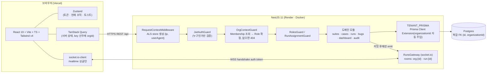
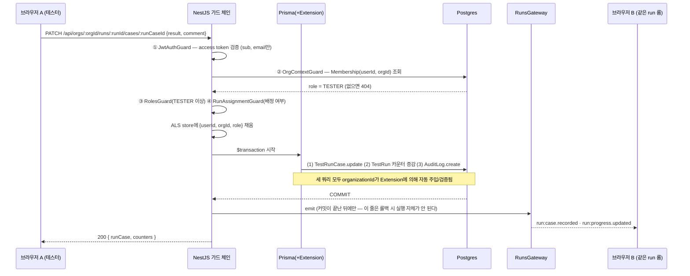
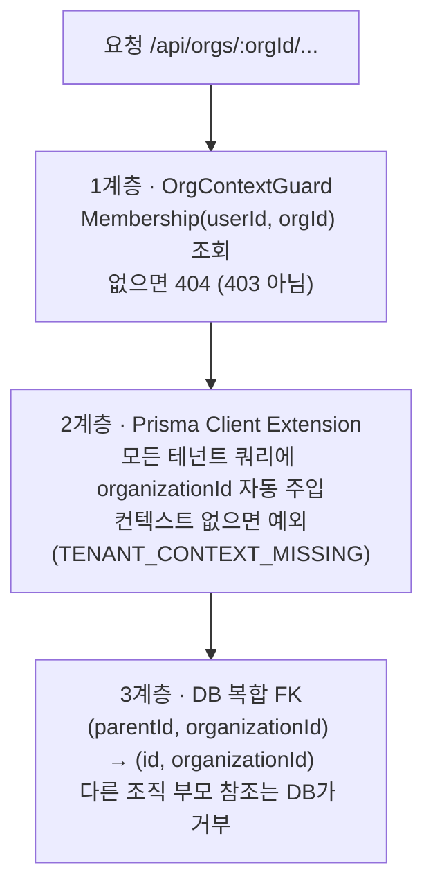
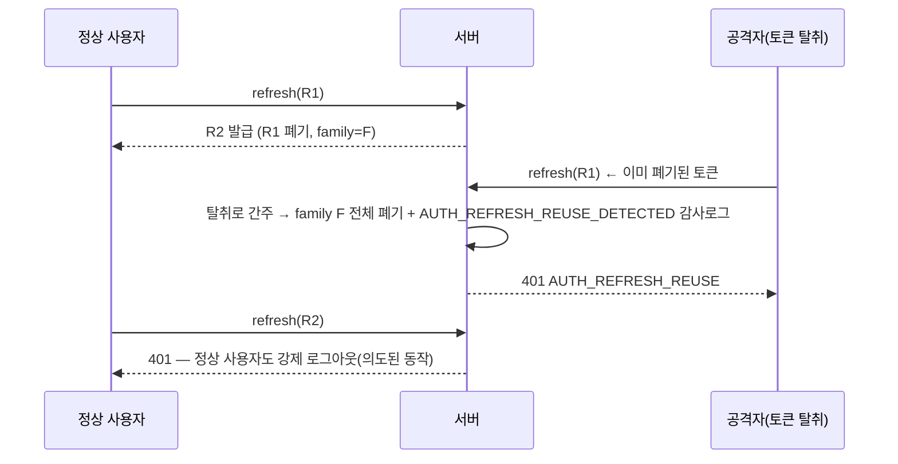

# STUDY — Runboard 학습 가이드 (1부)

> 이 문서는 **면접에서 이 프로젝트를 방어하기 위한 공부 자료**다.
> "코드가 이렇게 생겼다"가 아니라 **"이 기술이 뭐고, 왜 이걸 골랐고, 핵심 원리가 뭔지"** 를 신입 눈높이에서 설명한다.
> 분량이 많아 2부로 나눴다 — **1부(이 문서)**: 요약·아키텍처·기술 해설·핵심 설계 결정 / **[2부(STUDY-2.md)](./STUDY-2.md)**: 실시간·성능·실제 버그 7선·검수 프로세스·한계·학습 로드맵.

---

## 🎯 컷시트 (면접 당일 5분 훑어보기)

- **한 줄**: 여러 QA 조직이 같은 테이블을 공유하면서도 서로의 데이터를 절대 볼 수 없고, 여러 명이 같은 테스트 실행을 동시에 진행하면 결과가 실시간으로 동기화되며, 모든 변경이 트랜잭션 안에서 감사로그로 남는 멀티테넌트 QA 관리 SaaS.
- **핵심 설계 결정 ①**: 멀티테넌시를 "주장"이 아니라 3계층으로 구현했다 — 가드(인가) → Prisma Client Extension(사고 방지) → DB 복합 FK(최후의 그물). 앱 계층이 뚫려도 DB가 거부한다. (§4)
- **핵심 설계 결정 ②**: "깜빡하면 통과"가 아니라 "깜빡하면 실패"로 설계했다 — 조직 컨텍스트가 없으면 조용히 전체 조회가 되는 게 아니라 예외를 던진다. 감사로그는 트랜잭션 밖에서 호출조차 안 되도록 타입으로 막았다. (§6)
- **핵심 설계 결정 ③**: 실시간의 위험 두 가지를 구조로 차단했다 — 쓰기는 REST만(검증·인가·트랜잭션·감사 경로 단일화), emit은 커밋 이후에만(롤백된 상태를 방송하지 않는다). 후자는 실제로 테스트(T-16)로 증명했다. (STUDY-2.md §9)
- **가장 리스크였던 트러블슈팅**: CORS가 프로덕션에서 임의 오리진을 반사 허용하던 배포 블로커 — 보안 설정의 기본값은 "닫힘"이어야 하고, 설정이 없을 때 "조용히 열리는" 것이 가장 나쁘다는 판단으로 fail-fast 부팅으로 고쳤다. (STUDY-2.md §11-5)
- **데모 계정 원칙**: 우회한 것은 딱 하나, "이메일 형식 검증"뿐이고 인증 절차 자체는 전혀 우회하지 않는다 — admin도 예외 없이 bcrypt 통과 필수, 인증 없이 토큰을 발급하는 엔드포인트는 0건. (STUDY-2.md §14)

---

## 목차 (1부)

1. [프로젝트 요약](#1-프로젝트-요약)
2. [아키텍처와 데이터 흐름](#2-아키텍처와-데이터-흐름)
3. [사용 기술 해설 (신입 눈높이)](#3-사용-기술-해설-신입-눈높이)
4. [핵심 설계 결정 ① — 멀티테넌시 3계층 격리](#4-핵심-설계-결정--멀티테넌시-3계층-격리)
5. [핵심 설계 결정 ② — RBAC: Role을 토큰에 넣지 않는다](#5-핵심-설계-결정--rbac-role을-토큰에-넣지-않는다)
6. [핵심 설계 결정 ③ — 감사로그를 타입으로 강제](#6-핵심-설계-결정--감사로그를-타입으로-강제)
7. [핵심 설계 결정 ④ — 인증: refresh 회전 + 재사용 탐지](#7-핵심-설계-결정--인증-refresh-회전--재사용-탐지)
8. [핵심 설계 결정 ⑤ — 데이터 모델(스냅샷·복합 FK·비정규화 카운터)](#8-핵심-설계-결정--데이터-모델스냅샷복합-fk비정규화-카운터)

> 2부 목차: 실시간 아키텍처 / N+1·쿼리 예산 / 실제로 겪은 버그 7선 / 배포·인프라 / 검수(REVIEW) 프로세스 / 데모 계정 보안 / 남아 있는 한계 / 학습 로드맵 체크리스트 / 실습 과제

---

## 1. 프로젝트 요약

### 한 문장

**여러 QA 조직이 같은 테이블을 공유하면서도 서로의 데이터를 절대 볼 수 없고, 여러 명이 같은 테스트 실행을 동시에 진행하면 결과가 실시간으로 동기화되며, 모든 변경이 트랜잭션 안에서 감사로그로 남는 멀티테넌트 QA 관리 SaaS.**

### 무엇을 왜 만들었나

소규모 QA팀의 현실은 스프레드시트다. SPEC.md 1장이 정의한 다섯 가지 문제:

| 깨지는 것          | 현실                                                  | Runboard의 해결                                                         |
| ------------------ | ----------------------------------------------------- | ----------------------------------------------------------------------- |
| **추적 불가**      | 회차마다 시트 복사본 → 어느 버전을 돌았는지 모름      | **실행 시점 스냅샷**(`TestRunCase`) — 원본이 바뀌어도 기록은 불변       |
| **동시 작업 충돌** | 3명이 같은 시트를 채우면 셀이 덮이고 중복 수행        | **WebSocket 룸 브로드캐스트** + 프레즌스(누가 지금 보고 있는지)         |
| **수작업 이관**    | FAIL 발견 → 이슈 트래커에 재현 스텝 재입력            | RunCase 스냅샷 기반 **버그 초안 자동 생성**                             |
| **데이터 유출**    | 외주·계약직이 섞여 있는데 시트 공유 권한으로는 보장 X | **조직 단위 3계층 격리** + 조직 밖은 403이 아니라 **404**(존재 은닉)    |
| **책임 추적 불가** | "누가 이 예상결과를 언제 바꿨나"를 되짚을 방법이 없다 | **트랜잭션 내부 감사로그**(before/after diff, 불변, 수정·삭제 API 없음) |

### 이 프로젝트의 "핵심 가치" 3줄 (면접에서 이걸 먼저 말한다)

1. **멀티테넌시를 "주장"이 아니라 3계층으로 구현했다** — 가드(인가) → Prisma Client Extension(사고 방지) → DB 복합 FK(최후의 그물). 앱 계층이 뚫려도 DB가 거부한다.
2. **"깜빡하면 통과"가 아니라 "깜빡하면 실패"로 설계했다** — 조직 컨텍스트가 없으면 조용히 전체 조회가 되는 게 아니라 예외를 던진다. 감사로그는 트랜잭션 밖에서 호출조차 안 되도록 **타입**으로 막았다.
3. **실시간의 위험 두 가지를 구조로 차단했다** — 쓰기는 REST만(검증·인가·트랜잭션·감사 경로 단일화), emit은 **커밋 이후에만**(롤백된 상태를 방송하지 않는다). 후자는 실제로 테스트(T-16)로 증명했다.

### 스펙 한눈에

| 항목        | 값                                                                                         |
| ----------- | ------------------------------------------------------------------------------------------ |
| 유형 태그   | **실시간(WebSocket) + 인증/보안 고도화(RBAC + 감사로그)**                                  |
| 난이도 티어 | **L** (2~3일, 쇼케이스)                                                                    |
| 백엔드      | NestJS 11 · TypeScript · Prisma 7(+`@prisma/adapter-pg`) · Passport-JWT · socket.io · Pino |
| 검증        | **Zod 4 + nestjs-zod**(프론트/백엔드 같은 사고방식으로 통일)                               |
| 프론트      | Vite · React 19 · TS · Tailwind v4 · Zustand · TanStack Query · Axios · Recharts           |
| DB          | Neon Postgres(프로덕션) / Docker Postgres 16(로컬·테스트)                                  |
| 테이블      | 11개 (전역 2 + 테넌트 9)                                                                   |
| 테스트      | 단위 22 + **Testcontainers 통합 113** = 135                                                |
| 배포        | 프론트 Vercel · 백엔드 Render(Docker) · DB Neon — 전부 라이브                              |

---

## 2. 아키텍처와 데이터 흐름

### 2.1 시스템 구성도



**읽는 법.** 프론트와 백엔드는 서로 다른 도메인에 있는 두 서버다(Vercel ↔ Render). 그래서 로그인 상태는 쿠키가 아니라 **`Authorization: Bearer` 헤더**로 유지하고, **CORS**를 명시적으로 허용해야 한다. WebSocket도 같은 백엔드 호스트에 붙지만 HTTP 미들웨어 체인을 타지 않는다는 점이 뒤에서 중요해진다.

### 2.2 요청 1건의 수명 — "결과 기록"이 이 프로젝트의 대표 경로다



이 다이어그램 하나에 이 프로젝트의 설계 결정이 거의 다 들어 있다.

- **①~④ 가드가 4단계**인 이유: 인증(누구) / 테넌트(어느 조직) / 역할(무엇을 할 수 있나) / 리소스(이 실행에 배정됐나)는 **서로 다른 질문**이다. 한 곳에 몰아넣으면 재사용이 안 되고 누락이 생긴다.
- **ALS(AsyncLocalStorage)**: 가드가 알아낸 `{userId, orgId, role}`을 서비스·Prisma까지 **인자로 넘기지 않고** 전달하는 통로.
- **3쿼리 고정 트랜잭션**: 실행에 케이스가 500개여도 결과 기록 1번의 쿼리 수는 항상 3이다(집계 쿼리 없음).
- **커밋 후 emit**: `await tx.run(...)`이 반환된 다음 줄에 emit이 있다. 트랜잭션이 실패하면 예외가 던져져 emit 줄에 **도달조차 못 한다** — 이게 "롤백 시 이벤트 미발행"의 실제 보장 근거다.

### 2.3 폴더 구조 (핵심만)

```
backend/src/
├─ common/
│  ├─ context/request-context.ts          # AsyncLocalStorage 스토어 (Node 내장, 새 의존성 0)
│  ├─ guards/ jwt-auth · org-context · roles · run-assignment
│  ├─ filters/all-exceptions.filter.ts    # {statusCode, code, message, details} 단일 포맷
│  ├─ pipes/zod-validation.pipe.ts        # nestjs-zod 예외를 위 포맷으로 변환
│  └─ config/cors.config.ts               # 프로덕션에서 CORS_ORIGINS 없으면 부팅 실패(fail-fast)
├─ prisma/
│  ├─ prisma.service.ts                   # 원본 클라이언트 ("$system" 역할)
│  ├─ tenant.extension.ts                 # 조직 스코프 자동 주입/검증 ← 2계층
│  └─ tenant-transaction.service.ts       # 브랜드 타입 트랜잭션 실행기
├─ auth/                                  # 회원가입·로그인·refresh 회전·재사용 탐지
├─ organizations/                         # 조직·멤버십·초대
├─ suites/ cases/ runs/ bugs/ dashboard/ audit/
└─ runs/
   ├─ runs.gateway.ts                     # socket.io 인증·룸 조인 인가·프레즌스
   ├─ run-events.service.ts               # emit 전용 (트랜잭션을 아예 모른다)
   └─ run-presence.service.ts             # 인메모리 프레즌스
```

**주목할 점 하나**: `run-events.service.ts` 파일 상단 주석이 이렇게 되어 있다 — _"이 파일 자체는 트랜잭션을 전혀 모른다 — 그래야 '커밋 전에 emit'하는 실수가 여기 섞여들 수 없다."_ 규칙을 문서가 아니라 **모듈 경계**로 강제한 예다.

---

## 3. 사용 기술 해설 (신입 눈높이)

> 일반 개념 설명은 `_portfolio-index/`의 공용 베이직 문서로 옮겼다 — 아래 각 항목에 해당 링크를 달아뒀다. 여기 남은 건 "이 프로젝트가 왜 이렇게 썼나"뿐이다. AsyncLocalStorage·socket.io처럼 공용 문서가 없는 신기술은 프로젝트 판단으로 짧게 남겼다.

### 3.1 NestJS — 4단계 검사를 파이프라인 자리에 얹는다

> 일반 개념: [nestjs-basics.md §4 DI 컨테이너](../_portfolio-index/nestjs-basics.md#4-di-컨테이너--ioc) · [§5 요청 처리 파이프라인](../_portfolio-index/nestjs-basics.md#5-요청-처리-파이프라인) · [§7 Guard(인증/인가)](../_portfolio-index/nestjs-basics.md#7-guard--인증인가)

**왜 이 프로젝트에 이렇게 썼나.**

- 이 프로젝트의 핵심은 "요청이 도메인 코드에 닿기 전에 인증·테넌트·역할·배정 4단계 검사를 통과한다"는 것인데, NestJS의 미들웨어→가드→파이프→핸들러→필터 파이프라인이 그 자리를 정확히 제공한다.
- 4개 가드가 각각 다른 질문(누구인가/어느 조직인가/무슨 역할인가/이 리소스에 배정됐나)에 답하도록 분리했다 — 한 가드에 몰면 재사용이 안 되고 누락이 생긴다(`common/guards/*.ts`).
- `TENANT_PRISMA` 토큰을 `useFactory`로 제공해서(`prisma.module.ts`), 도메인 서비스는 "조직 스코프가 적용된 클라이언트"만 알 뿐 어떻게 적용되는지 모른다 — 격리 방식을 나중에 RLS로 바꿔도 서비스 코드는 안 바뀐다.
- `PrismaModule`은 `@Global()`이라 모든 모듈이 import 없이 주입받는다. `@RequireRole(Role.ADMIN)`은 메타데이터만 붙이고 `RolesGuard`가 `Reflector`로 읽어 판단한다 — "선언은 컨트롤러에, 판단은 가드에" 분리.
- 통합테스트가 `moduleRef.get(AuditService)`로 실제 프로바이더에 스파이를 걸 수 있는 것도 DI 덕분이다(T-16이 정확히 이렇게 한다).

### 3.2 AsyncLocalStorage — "요청마다 딸린 보이지 않는 가방" ★처음 쓰는 개념

공용 베이직 문서 없음(Node 내장 API) — 프로젝트 판단으로 정리.

**뭔가.** `node:async_hooks`. 한 비동기 실행 흐름에 값을 매달면, 거기서 파생된 모든 `await` 체인 어디서든 인자로 넘기지 않고 꺼내 쓸 수 있다.

**왜 이 프로젝트에 이렇게 썼나.**

- 조직 스코프를 강제하려면 Prisma 확장이 "지금 이 쿼리가 어느 조직 것인가"를 알아야 한다. 대안 두 개(모든 메서드에 `orgId` 전달, REQUEST 스코프 프로바이더)는 각각 "한 곳만 빠뜨려도 격리가 뚫린다"와 "요청마다 DI 트리를 새로 만드는 성능 비용 + Prisma 확장은 DI 밖에서 만들어져 접근이 어색"이라는 문제가 있어 ALS를 골랐다 — 인자 오염 0, 새 의존성 0(Node 내장).
- store는 **참조로 공유**된다. 미들웨어가 `{ip, userAgent}`로 store를 만들고, JwtAuthGuard가 `userId`를, OrgContextGuard가 `organizationId/role`을 **같은 객체에 얹는다**(`updateRequestContext`가 `Object.assign`).
- 함정은 **"흐름 밖"** 이다 — 소켓 핸드셰이크는 HTTP 미들웨어 체인을 안 타서 store 자체가 없다. 그래서 `RunsGateway`와 `RunsService.assertReadable()`은 원본(비확장) Prisma를 쓰고, 시드 스크립트는 `runWithRequestContext({...}, () => ...)`로 컨텍스트를 직접 열어준다(`common/context/request-context.ts`).

### 3.3 Prisma 7 + Client Extension(`$extends`) ★처음 쓰는 개념

> 일반 개념: [orm-basics.md §2 Prisma 기본](../_portfolio-index/orm-basics.md#2-prisma-기본) · [§7 트랜잭션](../_portfolio-index/orm-basics.md#7-트랜잭션) · [§8 마이그레이션 전략](../_portfolio-index/orm-basics.md#8-마이그레이션-전략)

**왜 이 프로젝트에 이렇게 썼나.**

- Prisma 7은 커넥션 URL이 스키마에서 빠지고 런타임 클라이언트가 드라이버 어댑터(`@prisma/adapter-pg`)로 커넥션을 만든다. `$use` 미들웨어가 제거된 자리를 대체하는 게 **Client Extension**인데, 이 프로젝트가 격리를 구현한 자리가 정확히 여기다(`prisma/tenant.extension.ts`).
- `query.$allModels.$allOperations` 훅으로 모든 모델·연산의 `args`를 가로채 조직 필터를 주입한다. `$extends`는 원본 클라이언트를 변형하지 않고 **새 클라이언트를 반환**하므로 `PrismaService`(원본)와 `TENANT_PRISMA`(확장)가 공존하고, **같은 엔진 인스턴스**를 공유해서 원본에 건 쿼리 리스너가 확장 클라이언트의 쿼리까지 잡는다(쿼리 카운터 테스트가 가능한 이유, 10-3).
- 마이그레이션은 `prisma.config.ts`가 읽는 **`DIRECT_URL`**(Neon 직결)로 돌린다 — 커넥션 풀러 뒤에서 DDL을 돌리지 않기 위해서.
- 인터랙티브 트랜잭션(`$transaction(async tx => {...})`)이 이 프로젝트의 "3쿼리 고정"과 "감사로그 원자성"의 기반이다 — 콜백이 예외를 던지면 자동 ROLLBACK, 정상 반환하면 COMMIT.

### 3.4 Zod + nestjs-zod

> 일반 개념: [nestjs-basics.md §6 Pipe(입력 검증)](../_portfolio-index/nestjs-basics.md#6-pipe--입력-검증) · [react-vite-basics.md §9 Zod](../_portfolio-index/react-vite-basics.md#9-zod--런타임-스키마-검증)

**왜 이 프로젝트에 이렇게 썼나.**

- class-validator 대신 고른 이유 셋: ① **프론트와 같은 라이브러리**를 써서 검증 규칙을 같은 사고방식으로 유지한다(`frontend/src/schemas/*.schema.ts`) ② 타입이 `z.infer`로 자동 추론돼 스키마와 타입이 절대 어긋나지 않는다(class-validator는 데코레이터와 타입을 사람이 맞춰야 한다) ③ `z.coerce.number()` 같은 변환이 내장이라 쿼리스트링(문자열)→숫자 변환이 스키마 하나로 끝난다.
- `createZodDto`가 만든 클래스를 컨트롤러 인자 타입으로 쓰면 **Swagger 문서에도 그대로 반영**된다.
- 실전 함정: `z.coerce.date()`가 nestjs-zod의 JSON Schema 변환을 깨뜨려서, 경계에서는 ISO 문자열로 받고 서비스 계층에서 Date로 변환했다(11-4 버그 참고).
- ⚠️ **정직 포인트**: `package.json`에 `class-validator`/`class-transformer`가 아직 남아 있는데 `src` 어디에서도 import되지 않는다(검수 🟡, 제거 대상으로 문서화).

### 3.5 Passport-JWT

> 일반 개념: [nestjs-basics.md §7 Guard(인증/인가)](../_portfolio-index/nestjs-basics.md#7-guard--인증인가)

**왜 이 프로젝트에 이렇게 썼나.**

- 토큰 추출·서명·만료 검증을 직접 짜면 알고리즘 혼동 공격 같은 실수를 하기 쉬워, Strategy(전략) 플러그인 단위로 인증 방식을 갈아끼우는 NestJS 표준 조합을 그대로 썼다.
- JWT는 `header.payload.signature`이고, payload는 **암호화가 아니라 인코딩**이라 비밀을 넣지 않는다. signature는 "내용을 위조하면 서명이 깨진다"만 보장할 뿐 "지금도 유효한가"는 보장하지 못한다 — 이 성질이 5장 RBAC 설계의 출발점이다.
- 이 프로젝트의 `JwtStrategy.validate()`는 `{ id: payload.sub, email: payload.email }`만 반환한다. **조직도 역할도 담지 않는 이유**는 5장에서 다룬다.

### 3.6 socket.io + NestJS Gateway

공용 베이직 문서 없음 — 9장이 이 프로젝트의 실시간 설계를 상세히 다룬다.

**왜 이 프로젝트에 이렇게 썼나.**

- WebSocket 그 자체가 아니라 그 위에 **자동 재연결·룸(room)·네임스페이스·ack 콜백·폴백 전송**을 얹은 라이브러리라서 골랐다 — 재연결·룸을 직접 구현하는 건 socket.io를 다시 만드는 일이다.
- `transports: ['websocket']`로 폴백(HTTP 롱폴링)을 **껐다** — Render 프록시 환경에서 polling→websocket 업그레이드가 불안정해서다.
- 기본 WS 어댑터는 `ws` 기반이라 socket.io를 쓰려면 `app.useWebSocketAdapter(new IoAdapter(app))`로 명시 교체해야 한다(`main.ts:20`).

### 3.7 Testcontainers ★강력한 어필 포인트

> 일반 개념: [nestjs-basics.md §9 테스트(Jest/supertest/Testcontainers)](../_portfolio-index/nestjs-basics.md#9-테스트--jest--supertest--testcontainers)

**왜 이 프로젝트에 이렇게 썼나.**

- 이 프로젝트가 증명하려는 것들 — 복합 FK가 타 조직 부모 참조를 거부(T-5), 트랜잭션 롤백 시 감사로그도 남지 않음(T-21), 카운터 원자 증감, 실제 SQL 왕복 횟수(N+1 회귀) — 이 **DB에서만 성립**해서 목이 아니라 진짜 Postgres가 필요했다.
- 스펙 파일마다 **독립 컨테이너**를 띄운다(속도보다 격리 우선) — e2e 113개가 이렇게 돈다.
- `execSync('npx prisma migrate deploy')`로 **배포와 완전히 같은 명령**으로 스키마를 적용한다. CI(GitHub Actions ubuntu 러너)는 Docker가 이미 떠 있어 추가 서비스 정의 없이 그대로 동작한다.

### 3.8 프론트 스택 — "상태의 소유권을 나눈다"

> 일반 개념: [react-vite-basics.md §5 Zustand](../_portfolio-index/react-vite-basics.md#5-zustand--클라이언트-상태) · [§6 TanStack Query](../_portfolio-index/react-vite-basics.md#6-tanstack-query--서버-상태) · [§7 역할 분담](../_portfolio-index/react-vite-basics.md#7-zustand--tanstack-query-역할-분담-워크스페이스-표준) · [§8 Axios 인터셉터](../_portfolio-index/react-vite-basics.md#8-axios--인터셉터-패턴)

**왜 이 프로젝트에 이렇게 썼나.**

- **Zustand**는 클라이언트 상태(토큰·현재 조직·토스트)만 갖는다 — 훅 밖(axios 인터셉터·socket auth)에서 `useAuthStore.getState()`로 읽어야 해서다.
- **TanStack Query**는 서버 상태 전부를 갖고, **쿼리 키 선두에 `orgId`를 고정**한다.
  ```ts
  export function orgScopedKey(orgId, ...rest) {
    return ["orgs", orgId ?? "no-org", ...rest] as const;
  }
  ```
  조직을 전환했는데 쿼리 키에 `orgId`가 없으면 전환 직후 화면이 이전 조직의 캐시를 그대로 보여준다 — 이걸 "조심하기"가 아니라 **키 생성 헬퍼 하나로만 만들게 강제**했다.
- **Axios 인터셉터**가 토큰 부착과 401→refresh 1회 재시도를 맡고, **in-flight refresh 공유**로 동시 401 경합을 막는다(7장에서 자세히).
- **socket.io-client**는 싱글턴 연결 1개 위에 룸을 여러 개 올린다. `auth`를 **함수**로 넘겨 토큰 갱신을 자동화한다.
- **Recharts**는 통과율 추이 차트에 쓰는데 번들의 큰 몫(단일 청크 870kB의 주요 원인)이라 알고 있는 한계로 남겼다.

---

## 4. 핵심 설계 결정 ① — 멀티테넌시 3계층 격리

### 4.1 멀티테넌시가 뭐고 왜 어려운가

**멀티테넌시**: 하나의 애플리케이션·DB를 여러 고객사(테넌트)가 공유하되, 서로의 데이터는 절대 보이면 안 되는 구조.

구현 방식은 크게 셋이다.

| 방식                                           | 격리 강도   | 비용                                                            |
| ---------------------------------------------- | ----------- | --------------------------------------------------------------- |
| DB/스키마 분리 (테넌트당 1개)                  | 최상        | 마이그레이션 N배, 프리티어 Neon 1 DB로는 불가. 소규모엔 과설계  |
| **공유 테이블 + `organizationId` 컬럼** ← 선택 | 설계에 달림 | 쿼리 하나라도 조건을 빠뜨리면 **전 조직 유출**                  |
| Postgres RLS(행 수준 보안)                     | 매우 높음   | 세션 변수 관리 + 풀러 뒤 트랜잭션 강제 + 정책 마이그레이션 부담 |

공유 테이블 방식의 진짜 위험은 **"where 조건을 하나 빠뜨리는 것"** 이다. 100개 쿼리 중 99개가 완벽해도 1개가 뚫리면 격리는 없는 것과 같다. 그리고 **코드 리뷰로 막는 건 확장성이 없다.**

### 4.2 그래서 3계층으로 감쌌다



각 계층이 **다른 종류의 실패**를 막는다는 게 핵심이다.

| 계층 | 막는 실패                                | 뚫렸을 때 다음 계층이 잡아주는가      |
| ---- | ---------------------------------------- | ------------------------------------- |
| 1    | **인가 실패** — 남의 조직에 접근         | 2계층: 컨텍스트가 안 채워져 예외      |
| 2    | **개발자 실수** — where 조건 누락        | 3계층: 부모가 다른 조직이면 DB가 거부 |
| 3    | **직접 SQL / 서비스 우회 / 데이터 오염** | 없음 — 여기가 마지막                  |

#### 1계층 — `OrgContextGuard` (인가)

```ts
const membership = await this.prisma.membership
  .findUnique({ where: { userId_organizationId: { userId, organizationId } } })
  .catch(() => null);
if (!membership)
  throw new DomainException(404, "NOT_FOUND", "조직을 찾을 수 없습니다.");
updateRequestContext({ organizationId, role: membership.role });
```

세 가지 디테일이 있다.

1. **403이 아니라 404**. 403은 "여긴 있는데 넌 못 봐"라서 **조직의 존재 자체를 알려준다**. 남의 조직 UUID를 무작위로 넣어 존재 여부를 스캔당할 여지를 없앤다. (조직 **안에서** 역할이 부족한 건 403 — 사용자가 관리자에게 권한을 요청할 수 있어야 하므로. 정책이 "404 vs 403"으로 명확히 갈린다.)
2. **`.catch(() => null)`** — 비UUID 문자열이 오면 Prisma가 검증 오류를 던지는데, 그것도 **404로 수렴**시킨다. 에러 메시지 종류로 "UUID 형식이면 존재는 한다" 같은 정보를 흘리지 않기 위해서.
3. **원본(비확장) Prisma를 쓴다.** 지금이 바로 조직 컨텍스트를 **확정하는 중**이라 ALS에 아직 `organizationId`가 없다. 확장 클라이언트로 이 조회를 하면 `TENANT_CONTEXT_MISSING`이 난다. 이 "닭과 달걀" 문제를 주석에 명시해뒀다.

#### 2계층 — Prisma Client Extension (사고 방지)

핵심은 **"누락 시 통과가 아니라 실패"** 다.

```ts
const ctx = getRequestContext();
if (!ctx?.organizationId) throw new MissingTenantContextError(model, operation);
```

만약 컨텍스트가 없을 때 그냥 통과시켰다면, **가드를 안 붙인 새 엔드포인트가 조용히 전 조직 데이터를 반환**했을 것이다. 실패 방향을 "닫히는 쪽"으로 설계한 것 — 보안 설계의 기본 원칙(fail-secure)이다.

연산별 주입 규칙:

| 연산                                     | 처리                                                 |
| ---------------------------------------- | ---------------------------------------------------- |
| `create`                                 | `data.organizationId`를 **컨텍스트 값으로 덮어쓴다** |
| `createMany`                             | 모든 행에 동일 처리                                  |
| `upsert`                                 | `where` + `create` 양쪽에 주입                       |
| 나머지(find/update/delete/count/groupBy) | `where.organizationId` 주입                          |

`create`에서 **덮어쓰기**인 게 중요하다. 클라이언트가 요청 body에 `organizationId: '<남의 조직>'`을 끼워 넣어도 마지막에 컨텍스트 값으로 덮여 무시된다(통합테스트 T-4가 이걸 검증한다).

**화이트리스트 방식과 제외 모델의 이유** — `TENANT_MODELS`에 8개 모델만 들어 있고, 제외 사유가 코드에 적혀 있다.

- `User`, `RefreshToken`: 전역 아이덴티티(조직에 속하지 않음)
- `Organization`: 테넌트 앵커 그 자체 — `organizationId` 컬럼이 없다(자기 자신이 id)
- `AuditLog`: `organizationId`가 **nullable**이라(로그인 등 조직 미상 이벤트) "항상 채운다" 규칙과 맞지 않는다 → `AuditService.record()/recordGlobal()`이 직접 책임진다

**왜 `where`만 덮어써도 `findUnique`에 안전한가.** Prisma 4.5+의 "extended where unique input" 덕분에 unique 셀렉터에 임의 스칼라 필터를 **추가로** 얹을 수 있다. 그래서 `findUnique({where: {id}})`가 `findUnique({where: {id, organizationId}})`가 되고, 다른 조직 id로 조회하면 **"없음"과 동일하게** 취급된다 — 존재 은닉 정책과도 일치한다.

#### 3계층 — DB 복합 FK (최후의 그물)

스키마 불변식 4개(DATA-MODEL.md 1장):

1. 모든 테넌트 테이블이 `organizationId`를 **직접** 갖는다(부모를 타고 유도할 수 있어도 비정규화해서 들고 있는다).
2. 부모 테이블은 `@@unique([id, organizationId])`를 갖는다 — 자식이 복합 FK로 참조할 **앵커**.
3. 자식은 `(parentId, organizationId) → (id, organizationId)` 복합 FK로 부모를 참조한다.
4. Prisma DSL이 표현 못 하는 자리는 **마이그레이션 SQL로 직접** 추가한다.

```sql
-- 20260827131827_tenant_integrity/migration.sql
ALTER TABLE "test_suites" DROP CONSTRAINT "test_suites_parentId_fkey";
ALTER TABLE "test_suites"
  ADD CONSTRAINT "test_suites_parent_same_org_fkey"
  FOREIGN KEY ("parentId", "organizationId")
  REFERENCES "test_suites"("id", "organizationId") ON DELETE CASCADE;
```

**왜 1번(비정규화)이 필요한가**를 이해하는 게 중요하다. `TestCase`는 `suiteId`로 스위트를 타고 올라가면 조직을 알 수 있다. 그런데도 `organizationId`를 직접 든 이유가 둘이다.

- **이유 ①**: 모든 조회에 `WHERE organization_id = ?`를 **단일 조건**으로 붙일 수 있다 → Prisma Extension이 모델별 분기 없이 한 줄로 동작한다.
- **이유 ②**: 모든 인덱스의 **선두 컬럼**을 `organization_id`로 만들 수 있다(테넌트 로컬리티) → 인덱스 스캔 범위가 조직별로 자연 분할된다.

그리고 비정규화의 위험(부모와 자식의 조직이 어긋나는 것)은 **복합 FK가 DB 레벨에서 막는다**. 즉 비정규화와 복합 FK는 세트다.

### 4.3 기각한 대안 (면접 단골)

| 대안                                        | 기각 이유                                                                                                                                                                                                            |
| ------------------------------------------- | -------------------------------------------------------------------------------------------------------------------------------------------------------------------------------------------------------------------- |
| 서비스마다 `where: { organizationId }` 수동 | 안전이 사람의 기억에 의존. 새 쿼리 하나 빠뜨리면 전 조직 유출. 리뷰로 막는 건 확장성이 없다.                                                                                                                         |
| **Postgres RLS**                            | 가장 강력하지만 Neon 풀러 뒤에서 `SET LOCAL`을 안전히 쓰려면 **모든 쿼리를 트랜잭션으로 감싸야** 하고, Prisma·마이그레이션·시드에 정책 관리 부담이 붙는다. L티어 2~3일 대비 비용 과다 → **README 향후 과제로 기록**. |
| 조직별 스키마/DB 분리                       | 프리티어 Neon 1 DB, 마이그레이션 N배. 소규모 SaaS에 과설계.                                                                                                                                                          |

> **RLS를 "몰라서 안 쓴 게 아니라 계산해서 안 썼다"**는 걸 보여주는 게 이 표의 목적이다. 그리고 "왜 4번째 방어선이 될 수 있는가"(DB가 세션 변수 기준으로 행을 필터링)까지 설명할 수 있어야 한다.

### 4.4 "정당한 예외" 4곳을 명시한 것

확장을 안 타는 원본 Prisma 사용처가 **정확히 4곳**이고, 각각에 "왜 여기서만 예외인가" 주석이 있다.

| 위치                                         | 이유                                                       |
| -------------------------------------------- | ---------------------------------------------------------- |
| `OrgContextGuard` — 멤버십 조회              | 지금 조직 컨텍스트를 **확정하는 중**이라 아직 ALS가 비었다 |
| `AuthService` — User/RefreshToken            | 전역 모델(조직에 속하지 않음)                              |
| `InvitationsService.accept()` — 토큰 조회    | 토큰만으로 조직을 알아내야 한다(조직을 아직 모름)          |
| `RunsGateway` / `RunsService.assertReadable` | 소켓 핸드셰이크는 HTTP 미들웨어를 안 타서 ALS가 없다       |

**예외를 없앤 게 아니라 "예외를 셀 수 있게" 만든 것**이 요점이다. 검수자가 4곳을 전수 확인하고 "전부 정당하다"고 판정할 수 있었던 것도 이 구조 덕분이다.

---

## 5. 핵심 설계 결정 ② — RBAC: Role을 토큰에 넣지 않는다

### 5.1 RBAC 기본

**RBAC(Role-Based Access Control)**: 사용자에게 직접 권한을 주지 않고 **역할**을 준 뒤, 역할에 권한을 매핑하는 방식.

이 프로젝트의 역할 4개와 등급:

```
ADMIN(3) > QA_LEAD(2) > TESTER(1) > VIEWER(0)
```

`ROLE_RANK` 상수 하나로 등급을 표현하고, `@RequireRole(Role.TESTER)`는 "TESTER **이상**"을 뜻한다. `RunAssignmentGuard`도 "QA_LEAD 이상이면 배정 무관 허용" 판단에 **같은 순위표를 재사용**한다 — 권한 서열이 코드에 두 번 나오지 않는다.

**중요**: 역할은 **사용자에 붙지 않고 `Membership`(사용자 × 조직)에 붙는다.** 같은 사람이 조직 A에서는 ADMIN, 조직 B에서는 VIEWER일 수 있다(데모 계정이 정확히 이걸 보여준다).

### 5.2 핵심 결정: Role을 JWT에 담지 않는다

**흔한 구현**은 로그인 시 토큰에 `{ sub, orgId, role }`을 박는 것이다. 요청마다 DB 조회가 없어 빠르다.

**그런데 문제가 있다.** JWT는 **stateless**다 — 발급 후 서버가 무효화할 수 없다. 그래서:

> ADMIN이 어떤 외주 인력을 TESTER → VIEWER로 강등하거나 조직에서 추방해도, **그 사람의 토큰이 만료될 때까지(15분)** 이전 권한으로 계속 쓰기가 가능하다.

외주·계약직이 섞이는 QA 도메인에서 이건 "불편"이 아니라 **실제 보안 결함**이다. 그래서:

| 담는 곳                       | 내용                                          |
| ----------------------------- | --------------------------------------------- |
| **Access Token**              | "너는 **누구**인가" — `{ sub, email, jti }`만 |
| **요청 시점 Membership 조회** | "이 조직에서 **무엇을 할 수 있나**" — Role    |

```ts
// jwt.strategy.ts — 반환값에 조직도 역할도 없다
validate(payload: AccessTokenPayload) { return { id: payload.sub, email: payload.email }; }
```

**조직 선택은 어디에?** URL 경로 파라미터(`/api/orgs/:orgId/...`)다. 그래서 서버는 완전히 무상태고, 조직이 Swagger·로그·테스트에 **눈에 보인다**. 프론트는 마지막 선택 조직만 localStorage에 저장하는데, 그건 **UX용이지 권한 근거가 아니다**.

### 5.3 트레이드오프를 정확히 말하기

**비용**: 요청당 쿼리 1회가 늘어난다.

**그 비용이 왜 감당 가능한가**:

- `@@unique([userId, organizationId])` 인덱스를 정확히 타는 **PK 룩업 수준**의 조회다.
- 요청당 이미 여러 쿼리가 나가는 상황에서 +1은 비율상 미미하다.
- 필요해지면 **짧은 TTL(수 초) 캐시**로 최적화할 여지가 있다 — 그때도 "즉시 반영"의 상한이 캐시 TTL로 명시적으로 관리된다는 게 토큰 만료(15분)보다 낫다.

**얻는 것**: 강등·추방이 **다음 요청부터 즉시** 반영된다. 이걸 통합테스트 T-12가 잠근다 — "역할을 TESTER→VIEWER로 강등한 **직후 기존 access token**으로 쓰기 시도 → 403". 토큰을 재발급받지 않았는데 권한이 바뀌었다는 게 증거다.

### 5.4 역할만으로 부족한 자리 — 리소스 수준 인가

"TESTER는 **자신이 배정된** 실행만 기록 가능"은 역할 검사로 표현할 수 없다. 같은 TESTER라도 실행마다 답이 다르기 때문이다. 그래서 가드를 하나 더 뒀다.

```ts
// RunAssignmentGuard
if (ctx?.role && ROLE_RANK[ctx.role] >= ROLE_RANK[Role.QA_LEAD]) return true; // 리드+는 배정 무관
const assignment = await this.prisma.testRunAssignee.findUnique({
  where: { testRunId_userId: { testRunId: runId, userId } }, // PK 룩업
});
if (!assignment)
  throw new DomainException(
    403,
    "RUN_NOT_ASSIGNED",
    "이 실행에 배정되지 않았습니다."
  );
```

- `TestRunAssignee`의 **PK가 `(testRunId, userId)`** 라서 이 조회가 곧 PK 룩업이다 — 가드 핫패스를 인덱스 설계로 지원한 예.
- 이 가드는 `TENANT_PRISMA`(확장 클라이언트)를 쓴다. `OrgContextGuard`가 **먼저** 실행돼 ALS를 채워뒀기 때문에 안전하다. 가드 실행 순서가 곧 계약이라는 걸 보여주는 지점이다.

**정리하면 인가가 3층이다**: 역할 등급(RolesGuard) → 리소스 소유/배정(RunAssignmentGuard) → 테넌트 경계(Extension). 각각이 다른 질문에 답한다.

---

## 6. 핵심 설계 결정 ③ — 감사로그를 타입으로 강제

### 6.1 감사로그를 어디서 쓸 것인가

문제: "케이스는 수정됐는데 감사로그만 안 남는" 상황을 어떻게 막나?

| 대안                                   | 기각 이유                                                                            |
| -------------------------------------- | ------------------------------------------------------------------------------------ |
| 글로벌 인터셉터에서 HTTP 단위 로깅     | 응답만 보고는 **before/after**를 알 수 없고, 커밋 성공 여부와 분리돼 실제와 어긋난다 |
| DB 트리거 / `pgaudit`                  | 애플리케이션 의미(누가·왜)를 모른다. 마이그레이션·이식성 비용도 크다                 |
| 커밋 후 이벤트 큐로 비동기 기록        | 인스턴스 1대에 큐 인프라 = 과설계. **유실 가능성이 감사 요구와 정면 충돌**           |
| **도메인 트랜잭션 안에서 기록** ← 선택 | 비즈니스 변경과 감사 기록이 **원자적** — 하나만 남으면 추적 신뢰도가 0이 된다        |

### 6.2 "규칙"을 타입으로 바꾸기 ★이 프로젝트의 시그니처 설계

원칙만 정하면 사람이 어긴다. 그래서 **트랜잭션 밖에서는 `AuditService.record()`를 호출할 수 없게** 타입을 설계했다.

```ts
// tenant-transaction.service.ts
declare const AUDIT_TX_BRAND: unique symbol;
type AuditBrand = { readonly [AUDIT_TX_BRAND]: true };

export type TenantAuditTransaction = Parameters<
  Parameters<TenantPrismaClient["$transaction"]>[0]
>[0] &
  AuditBrand;

@Injectable()
export class TenantTransactionService {
  run<T>(fn: (tx: TenantAuditTransaction) => Promise<T>): Promise<T> {
    return this.prisma.$transaction((tx) =>
      fn(tx as unknown as TenantAuditTransaction)
    );
  }
}
```

```ts
// audit.service.ts — 브랜드 타입만 받는다
async record(tx: TenantAuditTransaction, params: RecordScopedParams): Promise<void>
```

**브랜드 타입(branded type)이 뭔가.** TypeScript는 **구조적 타이핑**이라 "모양이 같으면 같은 타입"이다. 그래서 `type UserId = string`과 `type OrderId = string`은 서로 대입된다. 이걸 막으려고 **실재하지 않는 고유 심볼 프로퍼티**를 타입에만 붙인다.

```ts
declare const BRAND: unique symbol; // 런타임에 존재하지 않는다(declare)
type Branded = Base & { readonly [BRAND]: true };
```

이제 평범한 `Prisma.TransactionClient`는 `Branded`에 대입할 수 없다. **런타임 오버헤드는 0**(타입만의 장치)이고, 브랜드를 만드는 유일한 통로가 `TenantTransactionService.run()`(과 auth 전용 `runAuditableTransaction()`)뿐이라 **호출 경로가 하나로 좁혀진다.**

**효과**: "감사로그 누락"을 코드 리뷰가 아니라 **컴파일러가** 막는다.

> ⚠️ **정직하게 말할 한계** (코드 주석에도 적혀 있다): TS 구조적 타이핑 특성상 `as unknown as`로 캐스팅하면 뚫린다. 그래서 **브랜드를 만드는 경로를 이 파일 하나로 좁히고** "직접 캐스팅하지 말 것"이라는 관례로 보강했다. 완전 강제가 필요해지면 **ESLint 커스텀 룰**이 다음 단계다. 면접에서 이 한계를 먼저 말하면 신뢰도가 올라간다.

### 6.3 두 가지 기록 경로 — `record()` vs `recordGlobal()`

로그인 실패는 **조직이 정해지기 전** 이벤트다. 그래서 `AuditLog.organizationId`를 nullable로 바꾸고(마이그레이션 `audit_log_org_nullable`) 경로를 둘로 나눴다.

| 메서드           | 트랜잭션 타입            | organizationId | actor                        | 쓰는 곳                                      |
| ---------------- | ------------------------ | -------------- | ---------------------------- | -------------------------------------------- |
| `record()`       | `TenantAuditTransaction` | ALS에서 자동   | ALS에서 자동                 | 도메인 서비스 전부                           |
| `recordGlobal()` | `RawAuditTransaction`    | 항상 `null`    | **호출부가 명시적으로 전달** | auth (로그인 성공/실패, refresh 재사용 탐지) |

`recordGlobal`이 actor를 인자로 받는 이유: 로그인 시점엔 ALS에 아직 `userId`가 없다(인증이 지금 일어나는 중). 심지어 **계정이 존재하지 않는 경우에도** 시도한 이메일을 `actorEmail`로 스냅샷한다.

### 6.4 metadata를 안전하게 만드는 두 장치

**① 변경분만 담기** — `diffFields(before, after, allowedFields)`

```ts
if (JSON.stringify(prev) !== JSON.stringify(next))
  changed[field] = [prev, next];
```

`JSON.stringify` 비교인 이유가 재밌다. `steps` 같은 Json 필드는 매번 **새 배열 참조**라 `!==`가 항상 true다(내용이 같아도 "변경"으로 오탐). 직렬화 비교면 원시값과 Json을 같은 방식으로 옳게 처리한다.

**② 화이트리스트** — `allowedFields`에 없는 필드는 값이 달라도 절대 metadata에 담기지 않는다. 비밀번호·토큰 계열이 감사로그로 새는 경로를 원천 차단.

**③ `actorEmail` 스냅샷** — 멤버가 조직에서 제거돼도 로그가 "누구였는지"를 잃지 않는다(통합테스트 T-22가 검증).

> ⚠️ **알고 있는 한계**: `cases.service.ts`/`bugs.service.ts`가 `Object.keys(dto)`를 화이트리스트로 쓴다. 지금은 DTO 자체가 화이트리스트라 안전하지만, **나중에 DTO에 민감 필드가 늘면 그대로 새는 구조**다(검수 🟡). 명시적 필드 배열로 좁히는 게 옳다.

### 6.5 불변성

수정·삭제 API가 없다. 조회만 있고 ADMIN 전용이다. 감사로그는 **"고칠 수 있으면 감사가 아니다"** — 장기적으로 테이블이 계속 커지므로 `createdAt` 기준 파티셔닝이 향후 과제로 문서화돼 있다.

---

## 7. 핵심 설계 결정 ④ — 인증: refresh 회전 + 재사용 탐지

### 7.1 왜 access/refresh 두 개인가

| 토큰        | 수명 | 저장 위치                    | 성격                                             |
| ----------- | ---- | ---------------------------- | ------------------------------------------------ |
| **access**  | 15분 | 메모리 + localStorage        | JWT(자기 검증). 서버가 무효화 못 함 → 짧게 유지  |
| **refresh** | 7일  | DB에 **SHA-256 해시만** 저장 | **불투명 토큰**(random 256bit). 서버가 폐기 가능 |

**딜레마**: access를 길게 하면 탈취 시 피해가 크고, 짧게 하면 15분마다 로그인해야 한다. 해법이 refresh 토큰이다 — 평소엔 짧은 access를 쓰고, 만료되면 refresh로 조용히 새로 받는다.

**refresh를 JWT로 만들지 않은 이유**가 중요하다. JWT로 하면 **서버가 무효화할 수 없다**(그게 JWT의 성질이다). refresh는 반드시 폐기 가능해야 하므로 **DB에 상태를 두는 불투명 토큰**이 맞다.

```ts
const refreshTokenPlain = randomBytes(32).toString("base64url"); // 256bit 랜덤
await client.refreshToken.create({
  data: { tokenHash: sha256(refreshTokenPlain), familyId, expiresAt },
});
```

**해시만 저장하는 이유**: DB가 유출돼도 토큰을 **재구성할 수 없다**. 비밀번호를 bcrypt로 저장하는 것과 같은 논리. (비밀번호와 달리 SHA-256인 이유: refresh 토큰은 256bit 고엔트로피 랜덤이라 무차별 대입이 불가능해 느린 해시가 필요 없다.)

> `.env.example`에 `JWT_REFRESH_SECRET`이 남아 있었는데 **실제로는 안 쓴다**(검수 🟡). 코드가 아니라 env 예시가 잘못된 것 — 오히려 "refresh를 JWT로 안 만든 설계"가 더 나은 선택이므로 문서를 고치는 게 맞다.

### 7.2 회전(rotation)과 재사용 탐지(reuse detection)

**회전**: refresh를 쓸 때마다 기존 것을 폐기하고 새로 발급한다. 같은 `familyId`(계열 id)를 유지한다.

**재사용 탐지**: 이미 폐기된 refresh가 다시 들어오면? 정상 사용자는 그럴 일이 없다 — 회전 후엔 새 토큰만 갖고 있다. 그러므로 **누군가 옛 토큰을 복사해 갔다**는 신호다.



정상 사용자까지 로그아웃되는 게 **의도**다. 탈취가 의심되는 순간 계열 전체를 끊고 재로그인을 요구하는 게 안전하다.

### 7.3 ★실제로 겪은 버그 — "throw 이후에도 커밋돼 있어야 한다"

처음 구현은 폐기와 예외를 **같은 트랜잭션**에 넣었다.

```ts
// ❌ 처음 구현 (버그)
await prisma.$transaction(async (tx) => {
  await tx.refreshToken.updateMany({
    where: { familyId },
    data: { revokedAt: new Date() },
  });
  throw new DomainException(401, "AUTH_REFRESH_REUSE", "..."); // ← 이 throw가 위 UPDATE까지 롤백시킨다
});
```

**증상**: 재사용을 탐지했다고 401은 나가는데, **계열은 실제로 폐기되지 않았다.** 공격자가 같은 토큰으로 계속 시도할 수 있고, 감사로그도 안 남는다. 보안 기능이 "동작하는 척"만 하는 최악의 형태다.

**원인**: 인터랙티브 트랜잭션의 콜백에서 예외가 던져지면 **그 트랜잭션 전체가 ROLLBACK**된다. 예외 전에 실행한 UPDATE도 함께 사라진다.

**해결**: 폐기를 **그 자체로 완결된 별개의 작은 트랜잭션**으로 분리하고, 그게 커밋된 **뒤에** throw한다.

```ts
if (stored.revokedAt) {
  // 이 트랜잭션은 throw 이후에도 롤백되지 않고 반드시 커밋돼 있어야 한다(실제로 겪은 버그).
  await runAuditableTransaction(this.prisma, async (tx) => {
    await tx.refreshToken.updateMany({ where: { familyId: stored.familyId, revokedAt: null }, data: { revokedAt: new Date() } });
    await this.audit.recordGlobal(tx, { action: 'AUTH_REFRESH_REUSE_DETECTED', ... });
  });
  throw new DomainException(401, 'AUTH_REFRESH_REUSE', '...');   // 커밋 후에 던진다
}
```

**배운 것(일반화)**: 트랜잭션 경계는 "기술적으로 묶을 수 있는 범위"가 아니라 **"함께 성공하거나 함께 실패해야 하는 범위"** 로 정해야 한다. 여기선 "폐기+감사로그"가 한 단위고, "401 응답"은 그 단위 밖이다.

반대로 **정상 회전**은 폐기와 신규 발급을 **한 트랜잭션에 묶는다** — 둘 중 하나만 반영되면 계열이 끊기거나 중복 유효 토큰이 남기 때문이다. 같은 파일 안에서 트랜잭션 경계를 **서로 다르게** 잡은 두 사례가 나란히 있는 셈이다.

### 7.4 프론트의 짝 버그 — 동시 401 경합

서버가 재사용 탐지를 하면, **클라이언트가 refresh를 두 번 부르면 계열이 폐기된다.**

동시에 3개의 요청이 만료된 access token으로 나가면? 셋 다 401을 받고, 셋 다 독립적으로 refresh를 호출한다. 첫 번째가 성공하면 그 토큰은 폐기되고, **두 번째·세 번째는 "폐기된 토큰 재사용"으로 간주돼 계열 전체가 폐기 → 강제 로그아웃**된다.

```ts
// api-client.ts — 진행 중인 refresh Promise를 모든 동시 요청이 공유(큐잉)
let inFlightRefresh: Promise<string | null> | null = null;
...
inFlightRefresh ??= refreshAccessToken().finally(() => { inFlightRefresh = null; });
const newToken = await inFlightRefresh;
```

`??=`(nullish 할당) 한 줄로 "없으면 만들고, 있으면 그걸 기다린다"가 표현된다.

**추가 디테일 두 개**:

- **refresh 전용 axios 인스턴스**를 따로 둔다. 같은 인스턴스를 쓰면 refresh 자체가 401을 맞았을 때 인터셉터가 다시 refresh를 불러 **무한 루프**에 빠진다.
- `/auth/login`, `/auth/register`, `/auth/refresh`의 401은 **재시도 대상에서 제외**한다. 그건 "토큰 만료"가 아니라 "자격 증명이 틀렸다"는 뜻이라 refresh를 시도할 이유가 없다.

**서버 설계(재사용 탐지)와 클라이언트 설계(요청 큐잉)가 짝을 이룬다**는 게 이 이야기의 핵심이다. 한쪽만 알면 나머지 한쪽이 버그가 된다.

### 7.5 쿠키 대신 Authorization 헤더를 쓴 이유

프론트(Vercel)와 백엔드(Render)가 **다른 도메인**이다. 쿠키로 하려면:

- `SameSite=None; Secure` 크로스 사이트 쿠키 + **CSRF 방어 세트**(토큰 발급·검증)가 추가로 필요
- 브라우저의 서드파티 쿠키 정책 변화에 취약

헤더 방식은 이 배포 토폴로지에서 **가장 적은 코드로 안전**하다. 대신 **XSS에 노출되는 트레이드오프**가 있다(localStorage는 JS가 읽을 수 있다). 그래서 access 15분 + refresh 회전/재사용 탐지로 완화하고, README에 트레이드오프를 명시했다.

> 면접에서 "localStorage는 XSS에 취약한데요?"가 나오면: **"맞습니다. httpOnly 쿠키가 XSS 관점에선 우월합니다. 다만 크로스 도메인 배포에서는 CSRF 방어가 새로 필요해지고, 이 프로젝트 규모에선 그 세트를 제대로 갖추는 비용이 더 컸습니다. 대신 탈취 창을 15분으로 줄이고 refresh 회전+재사용 탐지로 지속 접근을 끊었습니다. 같은 도메인에 배포할 수 있다면 httpOnly 쿠키가 1순위입니다."** 로 답한다.

---

## 8. 핵심 설계 결정 ⑤ — 데이터 모델(스냅샷·복합 FK·비정규화 카운터)

### 8.1 실행 시점 스냅샷 — "과거는 변하면 안 된다"

`TestRun`을 만들면 선택된 `TestCase`들이 `TestRunCase`로 **복사**된다(제목·스텝·예상결과·우선순위).

```prisma
model TestRunCase {
  sourceCaseId   String?  @db.Uuid   // FK 없음(의도적) — 원본 삭제와 무관해야 하므로
  title          String
  steps          Json
  expectedResult String
  priority       CasePriority
  ...
}
```

**왜 참조가 아니라 복사인가.** 참조(FK)로 두면 원본 케이스의 제목·예상결과를 수정하는 순간 **3개월 전 실행 기록의 의미가 바뀐다**. "그때 뭘 기준으로 PASS를 줬는지"를 잃는다.

**`sourceCaseId`에 FK를 일부러 안 건 것**도 같은 이유다. 원본 케이스가 삭제돼도 과거 실행 기록은 남아야 한다. FK가 있으면 cascade 삭제되거나 삭제가 막힌다.

> 이건 study-fine의 **벌금 스냅샷**, 주문 시스템의 **주문 시점 가격 스냅샷**과 정확히 같은 원리다 — **"시간에 종속된 값은 파생 계산이 아니라 그 시점에 확정된 사실로 저장한다."** 면접에서 두 프로젝트를 엮어 말할 수 있는 지점.

부수 효과도 있다: 실행 상세 화면에서 케이스마다 원본을 다시 읽을 필요가 없다 → **N+1이 애초에 생기지 않는다.**

### 8.2 비정규화 카운터

`TestRun`에 `totalCount / passedCount / failedCount / blockedCount / skippedCount` 컬럼이 있다.

**왜 비정규화인가.** 결과를 기록할 때마다 `SELECT result, COUNT(*) FROM test_run_cases WHERE test_run_id = ? GROUP BY result`를 돌면, 실행에 케이스가 500개일 때 매 기록마다 500행을 훑는다. 카운터를 들면 **UPDATE 한 줄**이다.

**원자성**: `{ passedCount: { increment: 1 } }`은 SQL `SET "passedCount" = "passedCount" + 1`로 번역된다. 애플리케이션이 값을 읽어서 더한 뒤 쓰는 게(read-modify-write) 아니라 **DB가 한 문장으로 처리**하므로 동시 요청에서도 어긋나지 않는다.

**PENDING 컬럼이 없는 것도 설계다.** `progress = (total - pending) / total`이므로 PENDING은 `total - (나머지 합)`으로 유도한다. 그리고 `COUNTER_FIELD_BY_RESULT`에 PENDING 매핑이 없으므로, PENDING으로 되돌리는 연산이 **자동으로 "증감 없음"**이 된다 — 특수 분기가 필요 없다.

**정규화 논쟁 대비 답변**: "정규화가 막으려는 건 **중복으로 인한 불일치**입니다. 여기서 카운터는 파생값이 맞지만, ① 같은 트랜잭션 안에서만 갱신되고 ② 갱신 경로가 `applyCounterShift` 하나뿐이며 ③ 통합테스트가 합계 = total 불변식을 잠급니다. 대가로 결과 기록의 쿼리 수가 케이스 개수와 무관하게 고정됩니다."

### 8.3 인덱스가 쿼리 패턴과 1:1

DATA-MODEL.md 4장에 "실제 쿼리 → 사용 인덱스" 표가 있다. 몇 개만:

| 쿼리                      | 인덱스                                            | 왜 이 순서인가                                    |
| ------------------------- | ------------------------------------------------- | ------------------------------------------------- |
| 요청마다 멤버십·역할 확인 | `memberships(userId, organizationId)` unique      | **모든 요청이 도는 핫패스** — unique라 곧 PK 룩업 |
| 스위트 트리 로딩          | `test_suites(organizationId, parentId, position)` | 조직 전체를 1쿼리로 뽑고 정렬까지 인덱스가 해결   |
| 실행 화면 케이스 목록     | `test_run_cases(testRunId, position)`             | equality(testRunId) → sort(position) 순서         |
| 배정 여부 확인(가드)      | `test_run_assignees` **PK** `(testRunId, userId)` | 가드 핫패스를 PK로 만들었다                       |
| 감사로그 조회             | `audit_logs` 복합 인덱스 4종                      | 필터 4종(기본/대상/행위자/액션)과 **1:1 대응**    |

**원칙**: 복합 인덱스는 **equality 조건을 앞에, 정렬/범위를 뒤에** 둔다. 그리고 이 프로젝트에선 거의 모든 인덱스의 **선두 컬럼이 `organization_id`** 다 — 테넌트 로컬리티.

### 8.4 UUIDv7

`@default(uuid(7))`. UUIDv4는 완전 랜덤이라 B-tree 인덱스에 삽입될 때 **아무 데나 꽂혀서** 페이지 분할이 잦다. UUIDv7은 **앞부분이 타임스탬프**라 시간순으로 정렬되고 삽입 로컬리티가 좋다. 덤으로 `createdAt`의 보조 정렬 키로도 안정적이다.

### 8.5 데이터 수명 정책

| 데이터             | 정책                                                                  |
| ------------------ | --------------------------------------------------------------------- |
| TestSuite/TestCase | cascade 삭제. 단 **TestRunCase 스냅샷은 남는다**(FK 없음) → 과거 보존 |
| TestRun            | 삭제 없음(종료/중단만) — 감사 추적성                                  |
| BugReport          | 삭제 없음, 상태 전이만(WONTFIX)                                       |
| AuditLog           | 불변·삭제 없음                                                        |
| RefreshToken       | 만료·폐기 후에도 **재사용 탐지를 위해 만료 +7일까지 보관**            |

RefreshToken을 즉시 지우지 않는 게 포인트다. 지워버리면 폐기된 토큰이 다시 왔을 때 "재사용"이 아니라 "없는 토큰"이 되어 **탐지가 무력화**된다. (다만 정리 배치는 아직 없다 — 향후 과제로 명시.)

---

> **1부 끝.** 실시간 아키텍처, N+1·쿼리 예산, 실제로 겪은 버그 7선, 배포 트러블슈팅, 검수 프로세스, 데모 계정 보안, 남은 한계, 학습 로드맵은 **[STUDY-2.md](./STUDY-2.md)** 로 이어진다.
